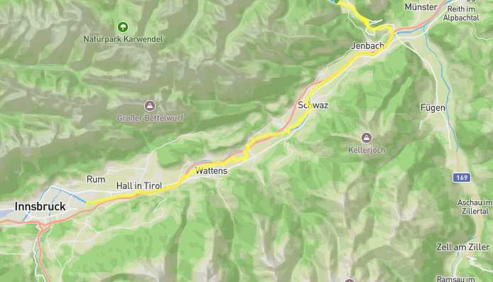

# Flow vélo : 597 km +3611 m / -4128 m

- [Le site officiel](https://muenchen-venezia.info/en/)
- [GPX global](files/munich-venise-est.gpx)

# 1. jeudi 14 août : Limoges ⟶ La Coquille

- 🚆 Limoges 12:18 - 15:00 Saint Yrieix
    - [Billet Cécile](./files/LIMOGES_ST-YRIEIX_CECILE.pdf)
    - [Billet Daniel](./files/LIMOGES_ST-YRIEIX_DANIEL.pdf)
- [🚲](./files/1-st-yrieix-la-coquille.gpx)
- [🏨](https://maps.app.goo.gl/DqpGEqF1U49bcsPg8) Le Refuge des Pélerins, Impasse Saint-Jean, 24450 LA COQUILLE, 05.53.52.64.25

# 2. vendredi 15 août : ⟶ Nontron

- [🚲](./files/02-la-coquille-nontron.gpx)

- [🏨](https://maps.app.goo.gl/uWECs62TbhtB2sN48) Camping L'Agrion Bleu, 120 Route du stade - St Martial de Valette - 24300 - Nontron, 05.53.56.02.04

# 3. samedi 16 août : ⟶ Angoulême

- [🚲](./files/3-nontron-angouleme.gpx)

- [🏨](https://maps.app.goo.gl/7YXNRGmedwTiZPAa8) Appart' City, 70, Avenue de Cognac 16000 ANGOULEME 

# 4. dimanche 17 août : ⟶ Cognac

- [🚲](./files/4-angouleme-cognac.gpx)

- [🏨](https://maps.app.goo.gl/zBwb7DgEkXsvuQjd6) Sylvie, 28 rue de Boutiers, 16100 Cognac, 06.61.38.65.19

# 5. lundi 18 août : ⟶ Saintes

- [🚲](./files/05-cognac-saintes.gpx)

- [🏨](https://maps.app.goo.gl/isRpQJ2tq6APXTer7) AJ Saintes, 2 Place Geoffroy Martel, 17100 SAINTES, 05.46.92.14.92

# 6. mardi 19 août : ⟶ Rochefort

- [🚲](./files/06-saintes-rochefort.gpx)

- [🏨](https://maps.app.goo.gl/QnxQRBcQvSck6pCF6) 29, rue Peltier, 17300 Rochefort

# 7. mercredi 20 août : ⟶ Ile d'Aix ⟶ Rochefort

- [🚲](./files/07-rochefort-ile-aix.gpx)

- 🏨 

# 8. jeudi 21 août : ⟶ La Tremblade

- [🚲](./files/08-rochefort-la-tremblade.gpx)

- [🏨](https://maps.app.goo.gl/Kj2U1X4C7vJxfkea8) 54, rue de la Noue, 17390 La Tremblade, 

# 9. vendredi 22 août : ⟶ Royan

- [🚲](./files/09-la-tremblade-royan.gpx)

- [🏨]() 78 boulevard Franck Lamy, 17200 Royan 

# 10. samedi 23 août, samedi 2 août : ⟶ Soulac ⟶ Royan

- [🚲](./files/10-royan-soulac.gpx)

- 🏨 

# 11. dimanche 24 août : ⟶ La Rochelle

- 🚆  Royan 13:00 - 15:15 Saintes 16:16 - 18:18 La Rochelle
    - [Billet Cécile](./files/ROYAN_LA-ROCHELLE_CECILE.pdf)
    - [Billet Daniel](./files/ROYAN_LA-ROCHELLE_DANIEL.pdf)
- 🏨

# 12. lundi 25 août : ⟶ Paris

- 🚆 La Rochelle 10:10 - 11:11 Paris
    - [Billet Cécile](./files/LA-ROCHELLE_PARIS_CECILE.pdf)
    - [Billet Daniel](./files/LA-ROCHELLE_PARIS_DANIEL.pdf)