# Flow vélo : 458 km +2885 m / -3242 m

[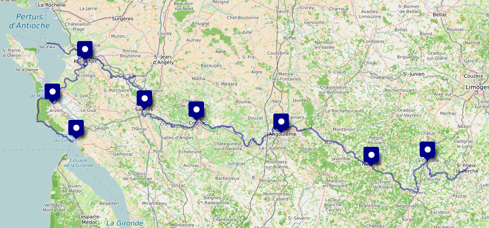](https://umap.openstreetmap.fr/en/map/flow-velo_1264424#10/45.7124/-0.0536)

- [Le site officiel](https://www.laflowvelo.com/)

# 1. jeudi 14 août : Limoges ⟶ La Coquille

- 🚆 Limoges 12:18 - 15:00 Saint Yrieix
    - [Billet Cécile](./files/LIMOGES_ST-YRIEIX_CECILE.pdf)
    - [Billet Daniel](./files/LIMOGES_ST-YRIEIX_DANIEL.pdf)
- [🚲 GPX](./files/01-st-yrieix-la-coquille.gpx)

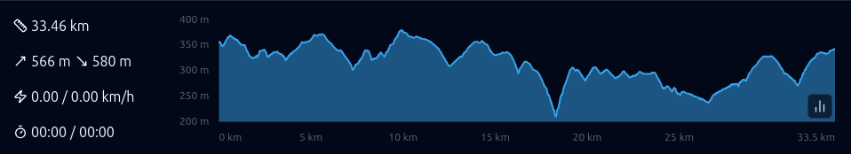

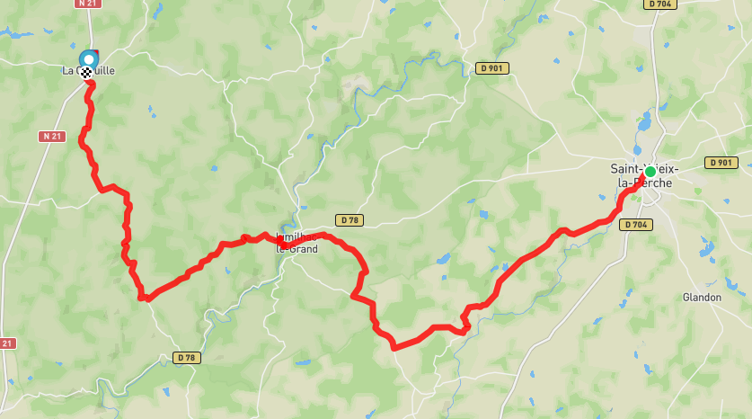

- [🏨](https://maps.app.goo.gl/DqpGEqF1U49bcsPg8) Le Refuge des Pélerins, Impasse Saint-Jean, 24450 La Coquille, 05.53.52.64.25

# 2. vendredi 15 août : ⟶ Nontron

- [🚲 GPX](./files/02-la-coquille-nontron.gpx)

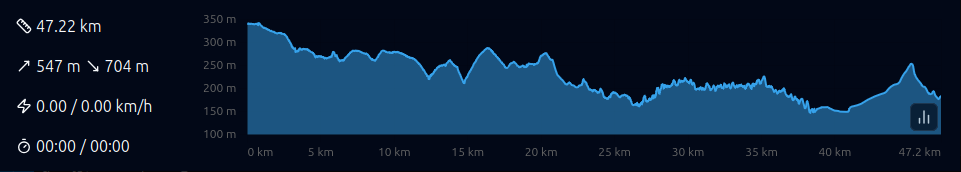

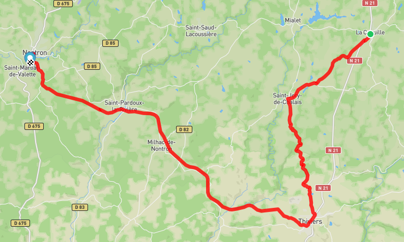

- [🏨](https://maps.app.goo.gl/uWECs62TbhtB2sN48) Camping L'Agrion Bleu, 120 Route du stade - St Martial de Valette - 24300 - Nontron, 05.53.56.02.04

# 3. samedi 16 août : ⟶ Angoulême

- [🚲 GPX](./files/3-nontron-angouleme.gpx)

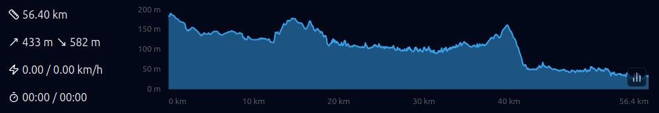

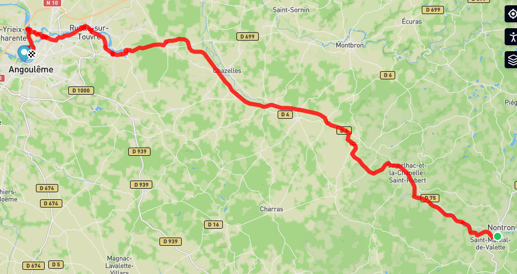

- [🏨](https://maps.app.goo.gl/7YXNRGmedwTiZPAa8) Appart' City, 70, Avenue de Cognac 16000 Angoulême 

# 4. dimanche 17 août : ⟶ Cognac

- [🚲 GPX](./files/4-angouleme-cognac.gpx)

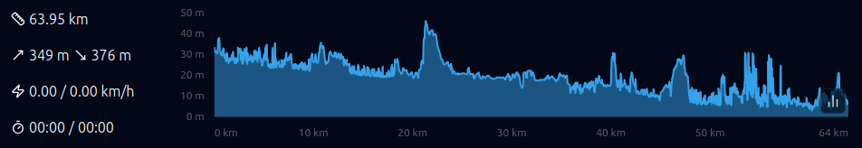

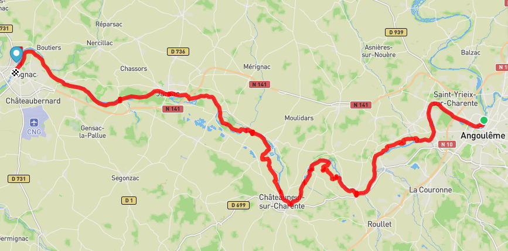

- [🏨](https://maps.app.goo.gl/zBwb7DgEkXsvuQjd6) Sylvie, 28 rue de Boutiers, 16100 Cognac, 06.61.38.65.19

# 5. lundi 18 août : ⟶ Saintes

- [🚲 GPX](./files/05-cognac-saintes.gpx)

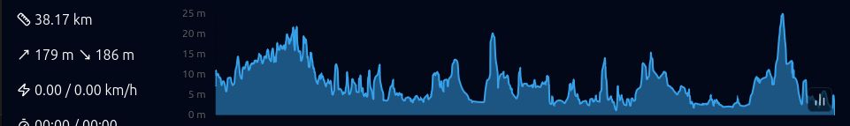

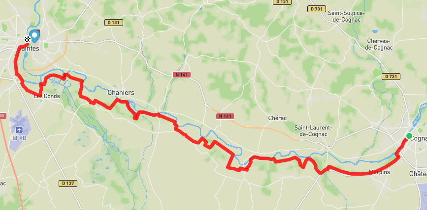

- [🏨](https://maps.app.goo.gl/isRpQJ2tq6APXTer7) AJ Saintes, 2 Place Geoffroy Martel, 17100 Saintes, 05.46.92.14.92

# 6. mardi 19 août : ⟶ Rochefort

- [🚲 GPX](./files/06-saintes-rochefort.gpx)

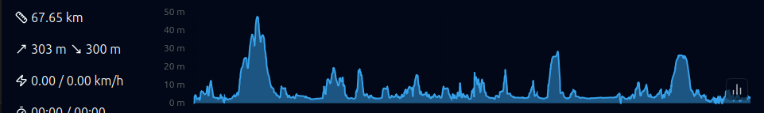

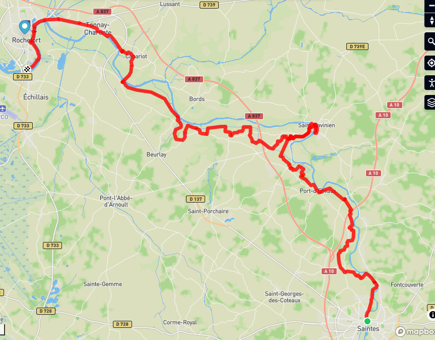

- [🏨](https://maps.app.goo.gl/QnxQRBcQvSck6pCF6) 29, rue Peltier, 17300 Rochefort

# 7. mercredi 20 août : ⟶ Ile d'Aix ⟶ Rochefort

- [🚲 GPX](./files/07-rochefort-ile-aix.gpx)

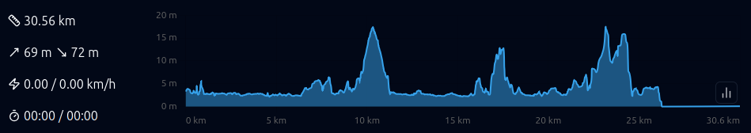

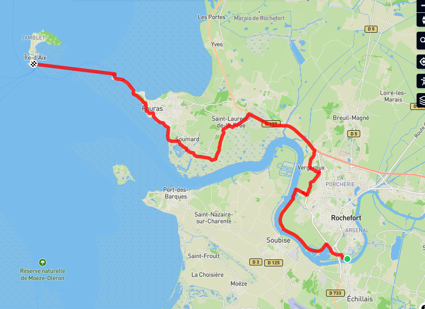

- 🏨 

# 8. jeudi 21 août : ⟶ La Tremblade

- [🚲 GPX](./files/08-rochefort-la-tremblade.gpx)

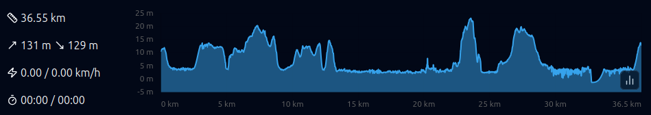

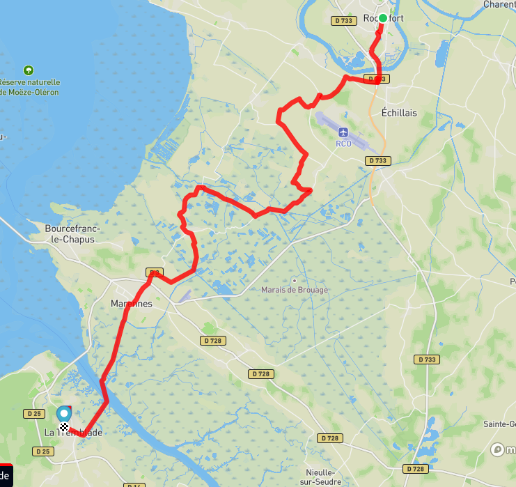

- [🏨](https://maps.app.goo.gl/Kj2U1X4C7vJxfkea8) 54, rue de la Noue, 17390 La Tremblade, 

# 9. vendredi 22 août : ⟶ Royan

- [🚲 GPX](./files/09-la-tremblade-royan.gpx)

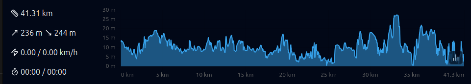

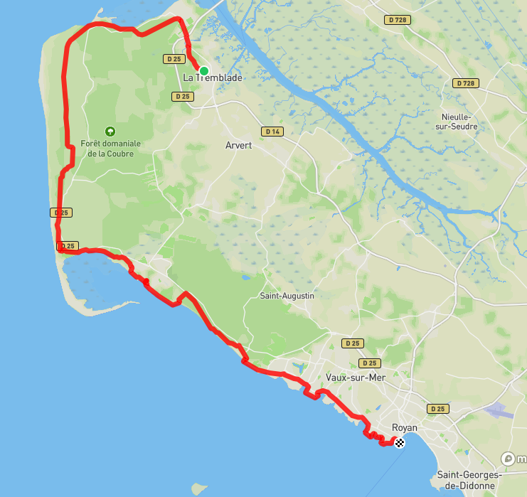

- [🏨](https://maps.app.goo.gl/sLRhc9wo9v4vpRc76) 78 boulevard Franck Lamy, 17200 Royan 

# 10. samedi 23 août : ⟶ Soulac ⟶ Royan

# 11. dimanche 24 août : ⟶ La Rochelle

- 🚆  Royan 09:28 - 09:53 Saintes 10:06 - 11:11 La Rochelle
    - [Billet Cécile](./files/ROYAN_LA-ROCHELLE_CECILE.pdf)
    - [Billet Daniel](./files/ROYAN_LA-ROCHELLE_DANIEL.pdf)
- [🏨](https://maps.app.goo.gl/p4o4YgM4hH6MZne67) AJ, Avenue des Minimes, 17000 La Rochelle, 05.46.44.43.11

# 12. lundi 25 août : ⟶ Paris

- 🚆 La Rochelle 10:10 - 11:11 Paris
    - [Billet Cécile](./files/LA-ROCHELLE_PARIS_CECILE.pdf)
    - [Billet Daniel](./files/LA-ROCHELLE_PARIS_DANIEL.pdf)