# Flow vélo : 458 km +2885 m / -3242 m

[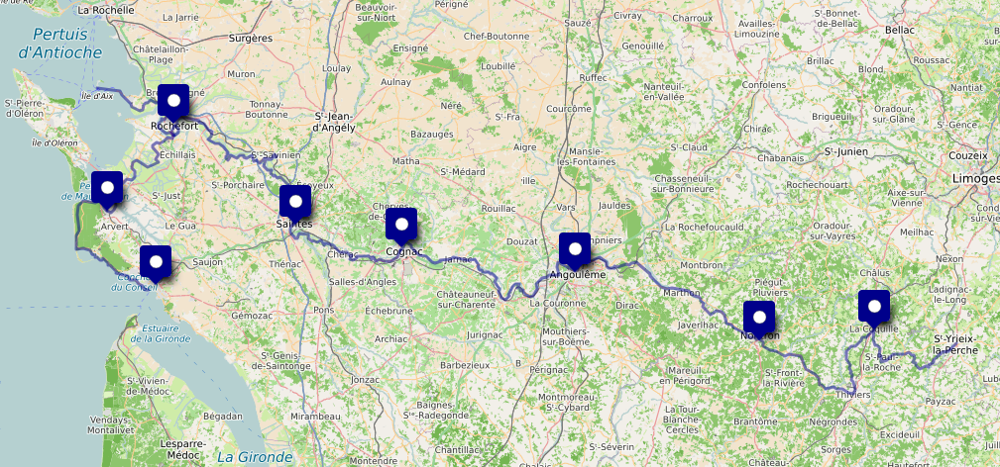](https://umap.openstreetmap.fr/en/map/flow-velo_1264424#10/45.7124/-0.0536)

- [Le site officiel](https://www.laflowvelo.com/)

# 1. dimanche 26 avril : Limoges ⟶ Thiviers

🚆 Limoges 16:18 - 17:03 Thiviers

[🏨](https://maps.app.goo.gl/bMN2qgM4Y1PWKgge6) [Camping le repaire, 24800 Thiviers, France](https://www.booking.com/hotel/fr/mobil-home-thiviers.fr.html)

<iframe id="widget_autocomplete_preview"  width="150" height="300" frameborder="0" src="https://meteofrance.com/widget/prevision/245510##3D6AA2" title="Thiviers"> </iframe>

# 2. lundi 27 avril : ⟶ Vouzan

- [🚲 Thiviers - Nontron](./files/02-la-coquille-nontron.gpx)
- [🚲 Nontron - Marthon](./files/3-nontron-angouleme.gpx)

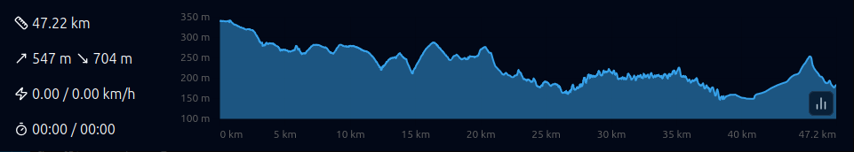

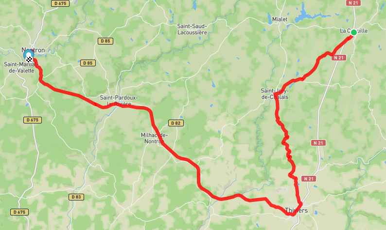

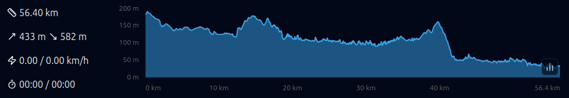

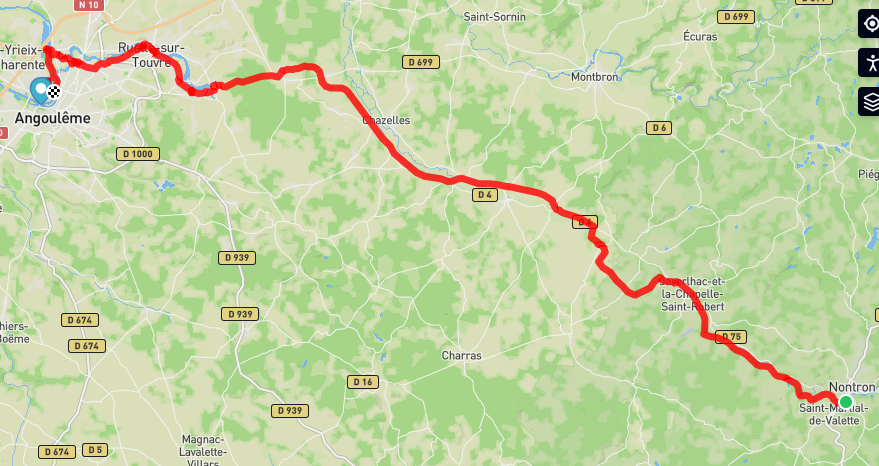

- [🏨](https://maps.app.goo.gl/t3oU5ogJ51rCcmhP8)[L'orée du Bois, 683 Maison Neuve, 16410 Vouzan](https://www.booking.com/hotel/fr/oree-de-bois.fr.html)

<iframe id="widget_autocomplete_preview"  width="150" height="300" frameborder="0" src="https://meteofrance.com/widget/prevision/164220##3D6AA2" title="Vouzan"> </iframe>

# 3. samedi 16 août : ⟶ Angoulême

- [🚲 GPX](./files/3-nontron-angouleme.gpx)

- [🏨](https://maps.app.goo.gl/7YXNRGmedwTiZPAa8) Appart' City, 70, Avenue de Cognac 16000 Angoulême

<iframe id="widget_autocomplete_preview"  width="150" height="300" frameborder="0" src="https://meteofrance.com/widget/prevision/160150##3D6AA2" title="Angoulême"> </iframe>

# 4. dimanche 17 août : ⟶ Cognac

- [🚲 GPX](./files/4-angouleme-cognac.gpx)

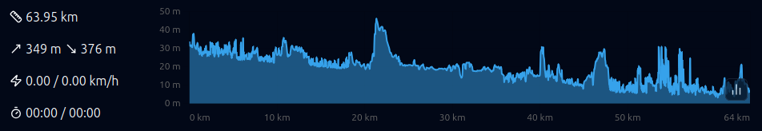

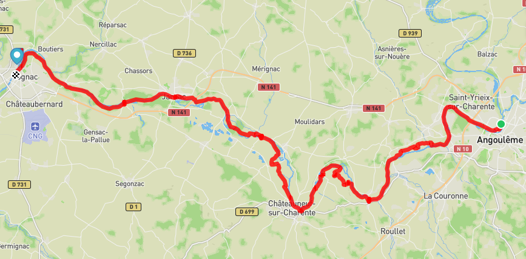

- [🏨](https://maps.app.goo.gl/zBwb7DgEkXsvuQjd6) Sylvie, 28 rue de Boutiers, 16100 Cognac, 06.61.38.65.19

<iframe id="widget_autocomplete_preview"  width="150" height="300" frameborder="0" src="https://meteofrance.com/widget/prevision/161020##3D6AA2" title="Cognac"> </iframe>

# 5. lundi 18 août : ⟶ Saintes

- [🚲 GPX](./files/05-cognac-saintes.gpx)

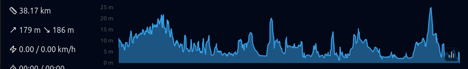

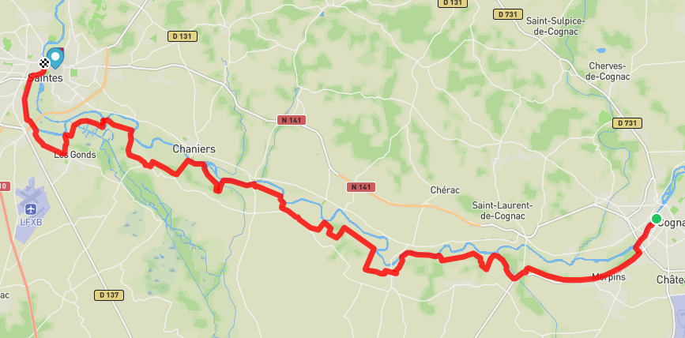

- [🏨](https://maps.app.goo.gl/isRpQJ2tq6APXTer7) AJ Saintes, 2 Place Geoffroy Martel, 17100 Saintes, 05.46.92.14.92

<iframe id="widget_autocomplete_preview"  width="150" height="300" frameborder="0" src="https://meteofrance.com/widget/prevision/174150##3D6AA2" title="Saintes"> </iframe>

# 6. mardi 19 août : ⟶ Rochefort

- [🚲 GPX](./files/06-saintes-rochefort.gpx)

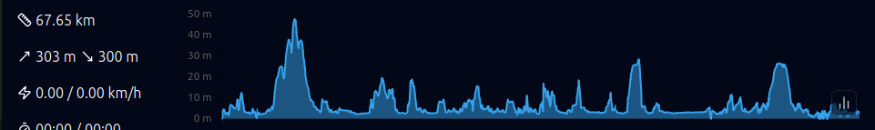

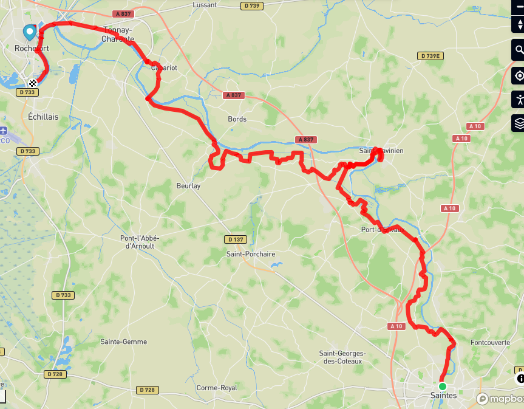

- [🏨](https://maps.app.goo.gl/QnxQRBcQvSck6pCF6) 29, rue Peltier, 17300 Rochefort

<iframe id="widget_autocomplete_preview"  width="150" height="300" frameborder="0" src="https://meteofrance.com/widget/prevision/172990##3D6AA2" title="Rochefort"> </iframe>

# 7. mercredi 20 août : ⟶ Ile d'Aix ⟶ Rochefort

- [🚲 GPX](./files/07-rochefort-ile-aix.gpx)

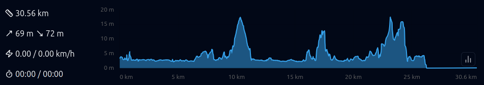

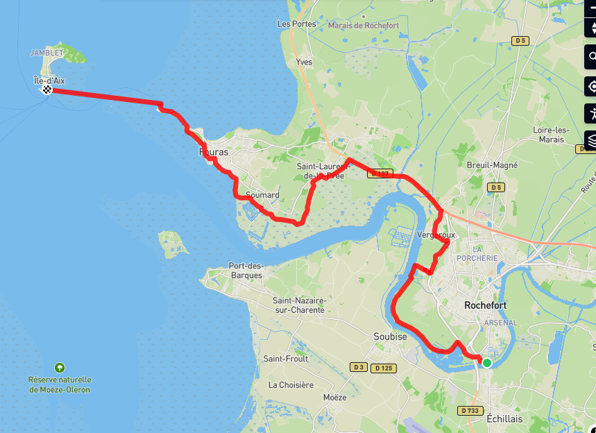

<iframe id="widget_autocomplete_preview"  width="150" height="300" frameborder="0" src="https://meteofrance.com/widget/prevision/171680##3D6AA2" title="Fouras"> </iframe>

# 8. jeudi 21 août : ⟶ La Tremblade

- [🚲 GPX](./files/08-rochefort-la-tremblade.gpx)

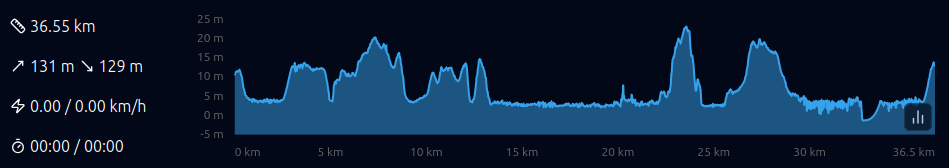

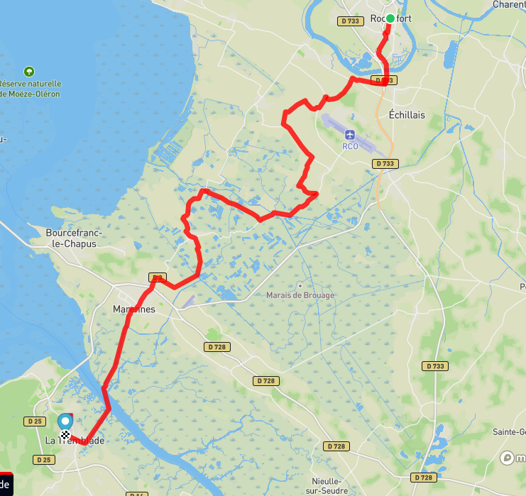

- [🏨](https://maps.app.goo.gl/Kj2U1X4C7vJxfkea8) 54, rue de la Noue, 17390 La Tremblade

<iframe id="widget_autocomplete_preview"  width="150" height="300" frameborder="0" src="https://meteofrance.com/widget/prevision/174520##3D6AA2" title="La Tremblade"> </iframe>

# 9. vendredi 22 août : ⟶ Royan

- [🚲 GPX](./files/09-la-tremblade-royan.gpx)

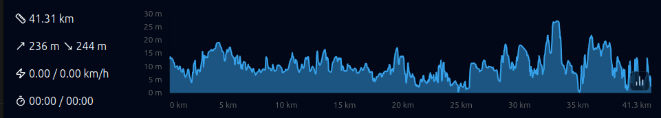

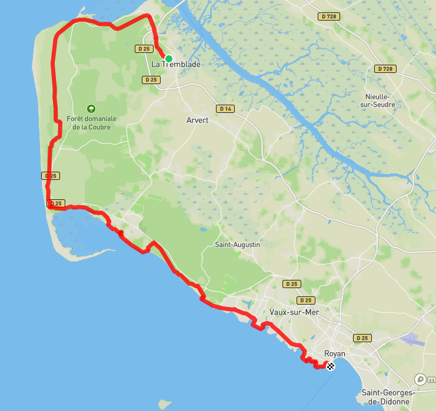

- [🏨](https://maps.app.goo.gl/sLRhc9wo9v4vpRc76) 78 boulevard Franck Lamy, 17200 Royan

<iframe id="widget_autocomplete_preview"  width="150" height="300" frameborder="0" src="https://meteofrance.com/widget/prevision/173060##3D6AA2" title="Royan"> </iframe>

# 10. samedi 23 août : ⟶ Soulac ⟶ Royan

<iframe id="widget_autocomplete_preview"  width="150" height="300" frameborder="0" src="https://meteofrance.com/widget/prevision/335140##3D6AA2" title="Soulac"> </iframe>

# 11. dimanche 24 août : ⟶ La Rochelle

- 🚆  Royan 09:28 - 09:53 Saintes 10:06 - 11:11 La Rochelle
- [🏨](https://maps.app.goo.gl/p4o4YgM4hH6MZne67) AJ, Avenue des Minimes, 17000 La Rochelle, 05.46.44.43.11

<iframe id="widget_autocomplete_preview"  width="150" height="300" frameborder="0" src="https://meteofrance.com/widget/prevision/173000##3D6AA2" title="La Rochelle"> </iframe>

# 12. lundi 25 août : ⟶ Paris

- 🚆 La Rochelle 08:48 - 12:33 Paris
