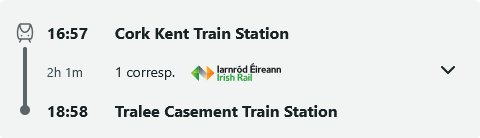
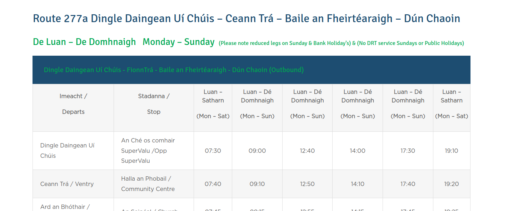
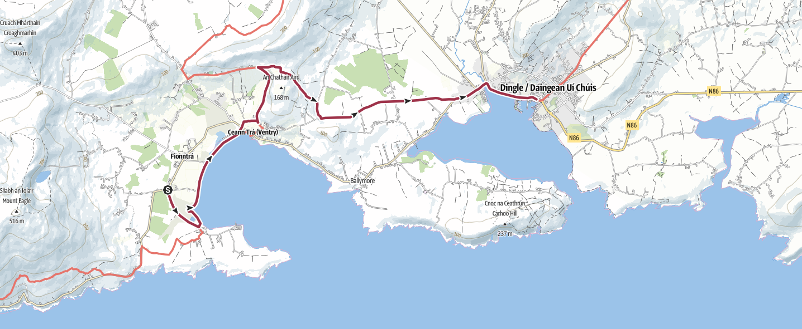
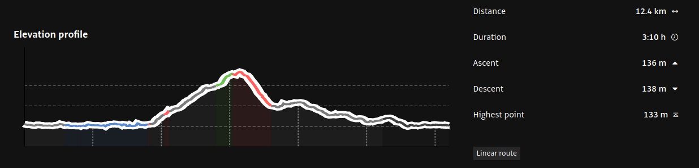
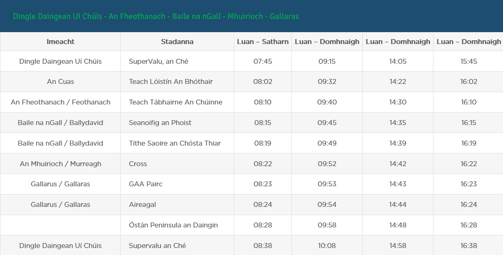
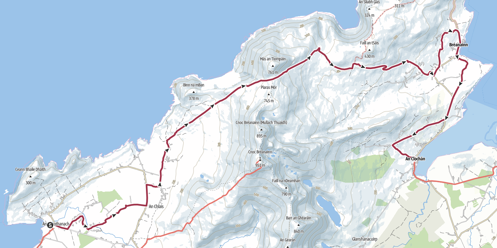
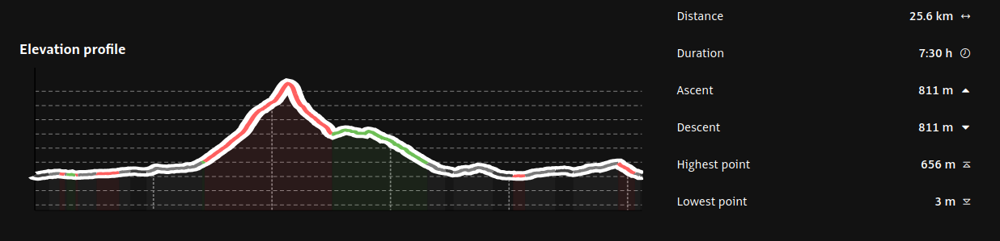
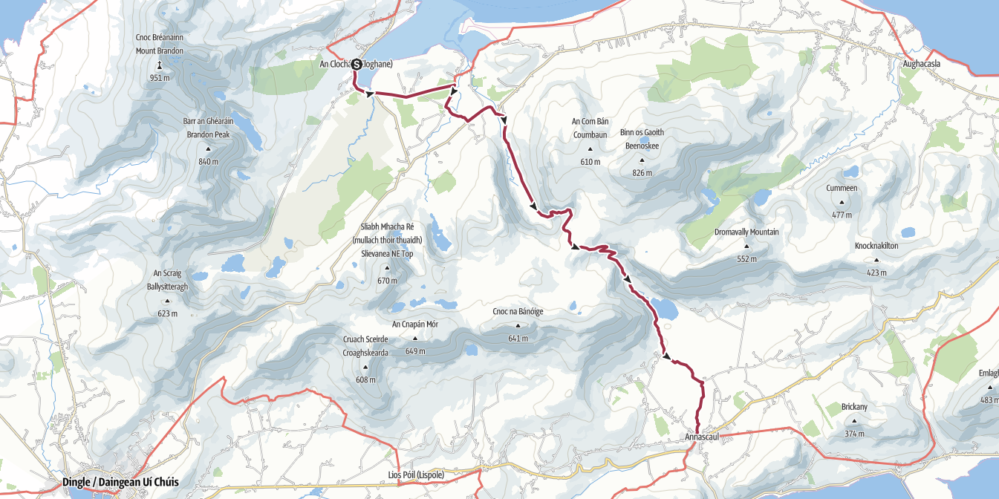
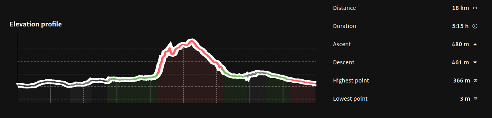

## The Dingle Way : 115 km +2440 m / -2410 m

## 1 - Lundi 13 juillet : Cork ⟶ Tralee

🚆 Cork 16:57 - 18:58 Tralee



🏨 <a href="https://maps.app.goo.gl/LcPY8piburQajFs16">Tralee Townhouse,
1 High Street, Tralee</a> · <a href="https://www.booking.com/hotel/ie/tralee-townhouse.fr.html">Booking</a>
<ul>
<li>L2</li>
<li>L2</li>
<li>L1 + L1</li>
<li>L1 + L1 + L1</li>
</ul>

## 2 - mardi 14 juillet - Tralee ⟶ Camp



 🥾 <a href="./files/tralee-camp.gpx">Tralee - Camp GPX</a> . 20 km, 350 D+, 280 D-

🏨 <a href="https://maps.app.goo.gl/LUnHQSR6yqHLQRZ57">Camp Cross, Camp Coach Field Camp, Camp,</a>· <a href="https://www.booking.com/hotel/ie/coach-field-camp.fr.html">Booking</a>
<ul>
<li>1 coach 6 personnes</li>
<li>1 coach 4 personnes</li>
</ul>

## 3 - mercredi 15 juillet - Camp ⟶ Annascaul

🥾 <a href="./files/camp-annascaul.gpx">Camp - Annascaul GPX</a> . 17 km, 310 D+, 350 D-

🏨 <a href="https://maps.app.goo.gl/Mbf269Ez1o78f9fm9">Lower Main Street Annascaul</a> . <a href="https://www.booking.com/hotel/ie/lavarna-house.fr.html">Booking</a>
<ul>
<li>L1 + L2</li>
<li>L1 + L1</li>
<li>L2</li>
</ul>

🏨 <a href="https://maps.app.goo.gl/Bs12DmdWYYZLQY6w9">Main Street, Ardrinane, Annascaul</a> . <a href="https://www.airbnb.fr/rooms/1561716437968515833">AirBnB</a>
<ul>
<li>L2</li>
<li>L1 + L2</li>
</ul>

## 4 - jeudi 16 juillet - Annascaul ⟶ Dingle



🥾 <a href="./files/annascaul-dingle.gpx">Annascaul - Dingle GPX</a> . 22.5 km, 360 D+, 380 D-

🏨 <a href="https://maps.app.goo.gl/cDaNdRzwGLYCsUsj7">Captain's House, the Mall, Dingle</a> . <a href="https://www.airbnb.fr/rooms/27215697">AirBnB</a>
<ul>
<li>contacter l'hôte Mary en sonnant à la porte sous le panneau Captain’s House. Si absente, code 1429 de la boîte à clés (+353 66 915 153)</li>
<li>L2</li>
<li>L2</li>
<li>L1 + L1</li>
</ul>

🏨 <a href="https://maps.app.goo.gl/wXUzPXMsLRAc6i1S8">Dingle Sea Horse Apartment, 6 B Orchard Lane, Dingle</a> . <a href="https://www.airbnb.fr/rooms/10952918">AirBnB</a>
<ul>
<li>L2</li>
<li>L1 + L1</li>
</ul>

## 5 - vendredi 17 juillet - Dingle ⟶ Ventry ⟶ Dingle

🚌 Dingle 12:40 - 12:55 Ventry

🥾 <a href="./files/ventry-dingle.gpx">Ventry - Dingle GPX</a> . 12 km, 140 D+, 140 D-

## 5 - samedi 18 juillet - Dingle ⟶ Feothanach ⟶ Cloghan

🚌 Dingle 09:15 - 09:40 Feothanach

🥾 <a href="./files/feothanach-cloghan.gpx">Feothanach - Cloghan GPX</a> . 26 km, 800 D+, 800 D-

🏨 <a href="https://maps.app.goo.gl/J8qxcPbWyUajRGGP9">O'Connor's Bar & Guesthouse, Main Street, An Clochán</a> . <a href="https://bookingengine.myguestdiary.com/1566/">Web site</a>
<ul>
<li>L2 + L1 + L1</li>
<li>L2 + L1</li>
<li>L1 + L1</li>
</ul>

## 6 - dimanche 19 juillet - Cloghan ⟶ Annascaul

🥾 <a href="./files/cloghan-annascaul.gpx">Cloghan - Annascaul GPX</a> . 18 km, 480 D+, 460 D-

