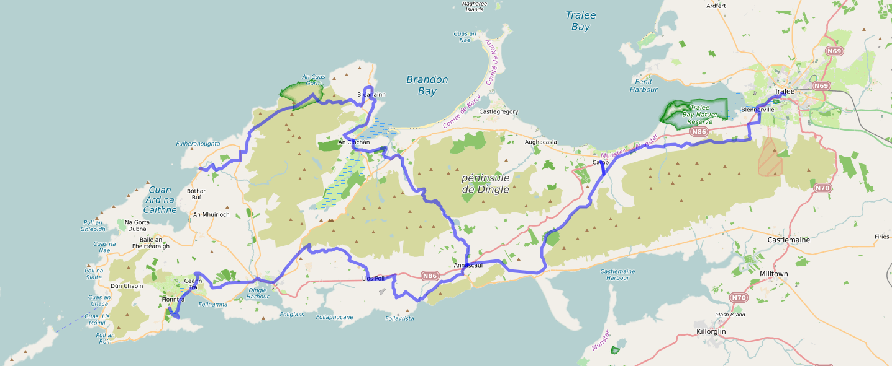
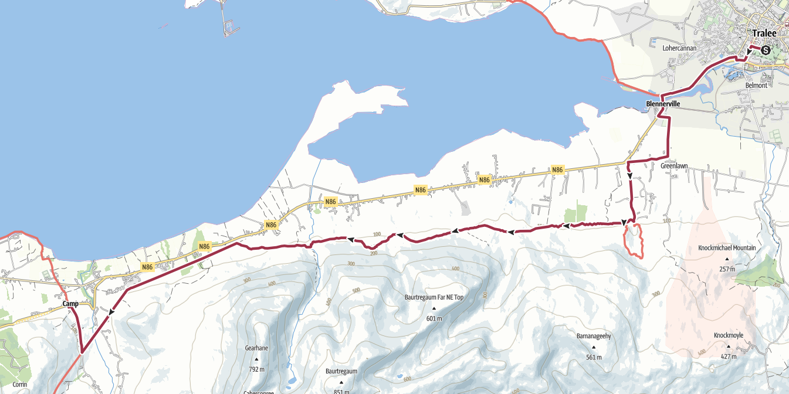
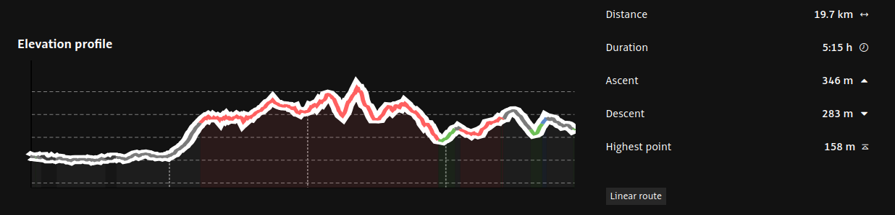
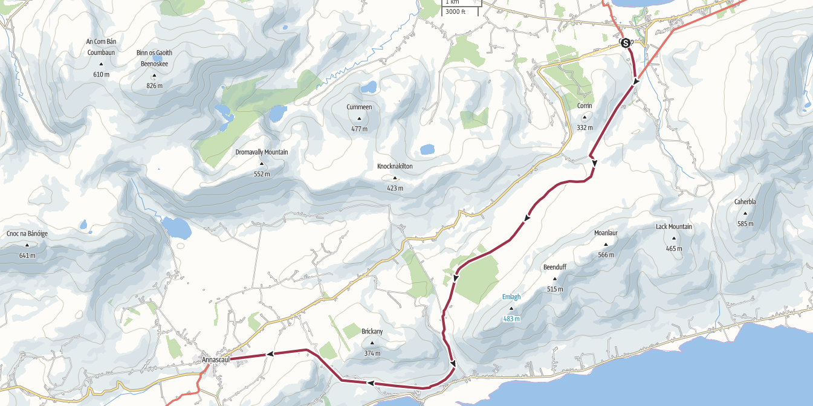
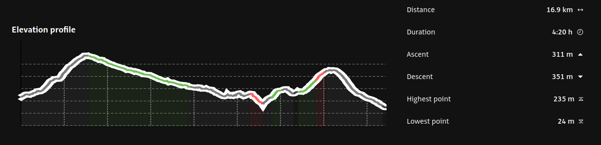
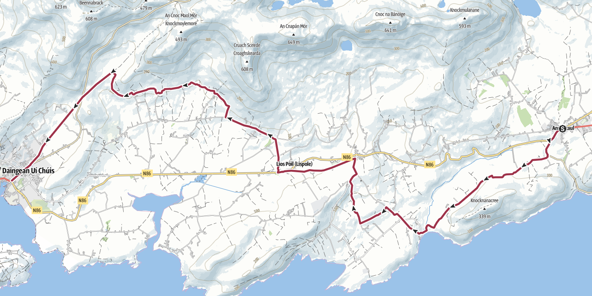
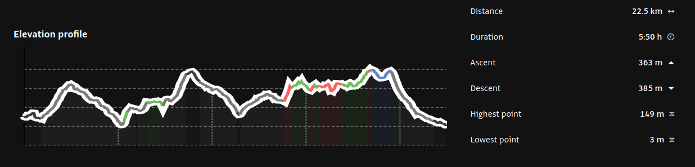

## The Dingle Way : xxx km +xxx m / -xxx m

## 1 - Lundi 13 juillet : Cork ⟶ Tralee

🚆 Cork 16:57 - 18:58 Tralee



🚲 <a href="./files/gisors-larocheguyon.gpx">Gisors - La Roche Guyon GPX</a> . 42 km, 265 D+, 300 D-

🏨 <a href="https://maps.app.goo.gl/LcPY8piburQajFs16">Tralee Townhouse,
1 High Street, Tralee</a> · <a href="https://www.booking.com/hotel/ie/tralee-townhouse.fr.html">Booking</a>
<ul>
<li>chambre double : Daniel Cécile (110€00)</li>
<li>chambre double : Philippe Nathalie (110€00)</li>
<li>chambre double (lits jumeaux) : Eric Stéphane (110€00)</li>
<li>chambre triple (3 lits simples) : Marie, Jacqueline et Béa  (43€35 /pers.)
<li>annulation gratuite jusqu’au 11/07/26, total 460€00 débités le 09/07/26</li>

## 2 - mardi 14 juillet - Tralee ⟶ Camp

 🥾 <a href="./files/tralee-camp.gpx">Tralee - Camp GPX</a> . xx km, xxx D+, xxx D-

🏨 <a href="https://maps.app.goo.gl/LUnHQSR6yqHLQRZ57">Camp Cross, Camp Coach Field Camp, Camp,</a>· <a href="https://www.booking.com/hotel/ie/coach-field-camp.fr.html">Booking</a>
<ul>
<li>1 pod de glamping 6 personnes  (230€00)</li>
<li>1 pod de glamping 4 personnes  (184€00)</li>
<li>serviettes et draps fournis</li>
<li>annulation gratuite jusqu’au 29/06/26. 414€00 débités le 28/06/26.</li>
<li>possibilité d'acheter à manger à la station service + pub dans le village.</li>
</ul>

## 3 - mercredi 15 juillet - Camp ⟶ Annascaul

🥾 <a href="./files/camp-annascaul.gpx">Les Andelys - Lyons La Foret GPX</a> . 57 km, 290 D+, 195 D-

🏨 <a href="https://maps.app.goo.gl/Mbf269Ez1o78f9fm9">Lower Main Street Annascaul</a> . <a href="https://www.booking.com/hotel/ie/lavarna-house.fr.html">Booking</a>
<ul>
<li>Chambre 1 - 1 lit simple et 1 lit double (2 personnes seules)
<li>Chambre 2 - 2 lits simples</li>
<li>Chambre 3 - 1 lit double (1 couple)</li>
<li>6 personnes maximum dans cet hébergement</li>
<li>serviettes et draps fournis.</li>
<li>annulation gratuite jusqu’au 09/07/26. Total 350€00 débités le 08/07/26</li>
</ul>

🏨 <a href="https://maps.app.goo.gl/Bs12DmdWYYZLQY6w9">Main Street, Ardrinane, Annascaul</a> . <a href="https://www.airbnb.fr/rooms/1561716437968515833">AirBnB</a>
<ul>
<li>chambre 1 - grand lit (1 couple)</li>
<li>chambre 2 - petit et grand canapé lit</li>
<li>serviettes et draps fournis</li>
<li>réservation effectuée pour 3 personnes.</li>
<li>annulation gratuite avant le 14/07/26 -  219€85 réglés le 05/11/25</li>
</ul>

## 4 - jeudi 16 juillet - Annascaul ⟶ Dingle

🥾 <a href="./files/annascaul-dingle.gpx">Lyons La Foret - Gournay en Bray GPX</a> . 64 km, 664 D+, 673 D-

🏨 <a href="https://maps.app.goo.gl/cDaNdRzwGLYCsUsj7">Captain's House, the Mall, Dingle</a> . <a href="https://www.airbnb.fr/rooms/27215697">AirBnB</a>
<ul>
<li>contacter l'hôte Mary en sonnant à la porte sous le panneau Captain’s House. Si absente, code 1429 de la boîte à clés (+353 66 915 153)</li>
<li>chambre 1 - lit double (Philippe et Nathalie)</li>
<li>chambre 2 - lit double (Cécile et Daniel)</li>
<li>chambre 3 - 2 lits simples (Eric et Stéphane)</li>
<li>serviettes et draps fournis.</li>
<li>annulation possible avant le 11/07/26  - 637€33 = 53€15 / personne / nuit débités le 03/07/26</li>
</ul>

🏨 <a href="https://maps.app.goo.gl/wXUzPXMsLRAc6i1S8">Dingle Sea Horse Apartment, 6 B Orchard Lane, Dingle</a> . <a href="https://www.airbnb.fr/rooms/10952918">AirBnB</a>
<ul>
<li>chambre 1 - 1 lit double (1 personne seule)</li>
<li>chambre 2 - 2 lits simples</li>
<li>serviettes et draps fournis.</li>
<li>appartement pour 3 personnes: 438,53 € les 2 nuits ( 73€ /pers /nuit)</li>
<li>annulation avant le 16/06/26 - 251,03 € réglés le 04/11/25 - 187,50 € seront débités le 01/07/26.</li>
</ul>

## 5 - dimanche 21 juin, Gournay en Bray ⟶ Gisors ⟶ Paris

🚲 <a href="./files/gournayenbray-gisors.gpx">Gournay en Bray - Gisors GPX</a> . 35 km, 313 D+, 353 D-

🚆 Gisors 15:55 - 17:16 Paris

