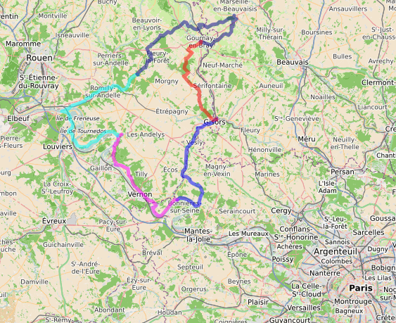
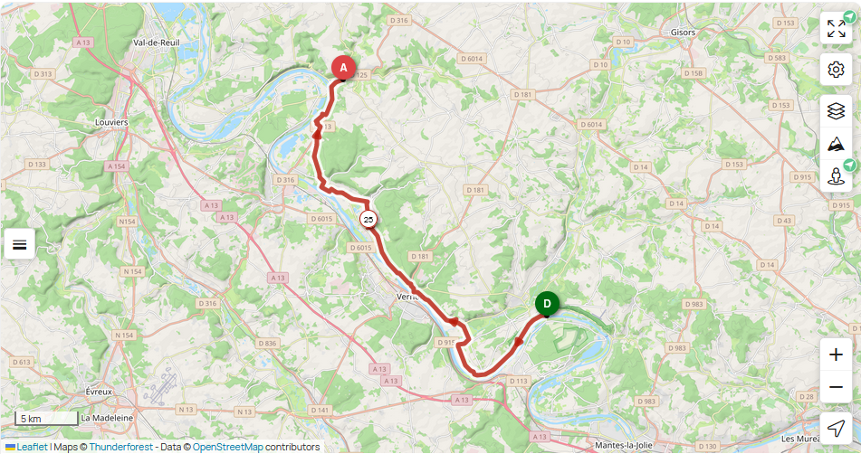
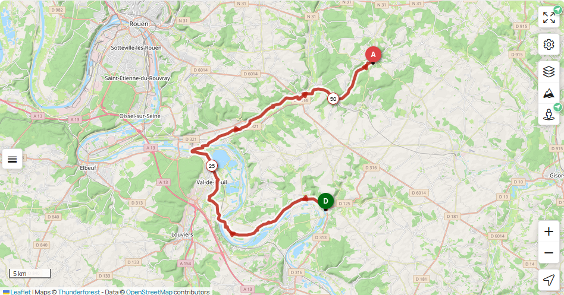
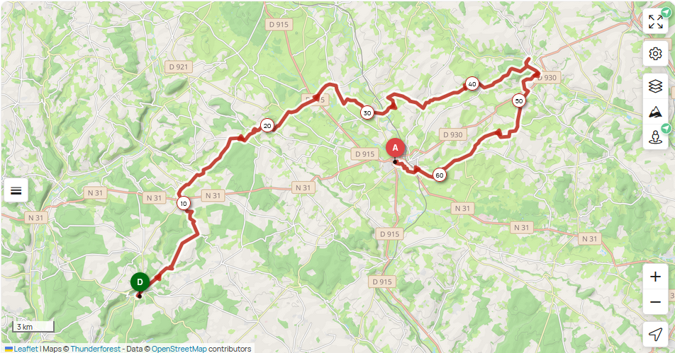
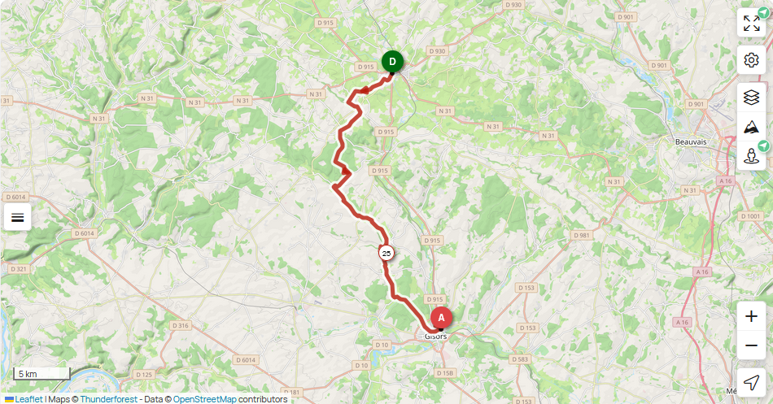

## Eure et Oise à vélo : x km +x m / -x m

## 1 - mercredi 17 juin : Paris ⟶ Gisors ⟶ La Roche Guyon

🚆 Paris xx:xx - xx:xx Gisors

<iframe id="widget_autocomplete_preview"  width="150" height="300" frameborder="0" src="https://meteofrance.com/widget/prevision/272840##3D6AA2" title="Gisors"> </iframe>

🚲 <a href="./files/gisors-larocheguyon.gpx">Gisors - La Roche Guyon GPX</a> . xx km, xx D+, xx D-

🏨 <a href="https://maps.app.goo.gl/7trkwBDdTcvqHRBLA">Hotel Les Bords de Seine, 21 rue du Docteur Duval, 95780 La Roche-Guyon</a> · <a href="https://www.booking.com/hotel/fr/les-bords-de-seine.html">Booking</a>

<iframe id="widget_autocomplete_preview"  width="150" height="300" frameborder="0" src="https://meteofrance.com/widget/prevision/955230##3D6AA2" title="La Roche Guyon"> </iframe>

## 2 - jeudi 18 juin, La Roche Guyon ⟶ Les Andelys

🚲 <a href="./files/larocheguyon-lesandelys.gpx">La Roche Guyon - Les Andelys GPX</a> . xx km, xx D+, xx D-

🏨 <a href="https://maps.app.goo.gl/8VnMDgUiGyf8azD79">Hotel Les Iris, 8-10 rue Georges Clémenceau, 27700 Les Andelys</a>· <a href="https://www.booking.com/hotel/fr/les-iris-les-andelys.html">Booking</a>

<iframe id="widget_autocomplete_preview"  width="150" height="300" frameborder="0" src="https://meteofrance.com/widget/prevision/270160##3D6AA2" title="Les Andelys"> </iframe>

## 3 - vendredi 19 juin, Les Andelys ⟶ Lyons La Forêt

🚲 <a href="./files/lesandelys-lyonslaforet.gpx">Les Andelys - Lyons La Foret GPX</a> . xx km, xx D+, xx D-

🏨 <a href="https://maps.app.goo.gl/bkXUkUPyxbVwWpxbA">Camping Saint Paul,
2 Rte Saint-Paul, 27480 Lyons-la-Forêt</a> . <a href="https://campingsaintpaul-27.fr">Site web</a>

<iframe id="widget_autocomplete_preview"  width="150" height="300" frameborder="0" src="https://meteofrance.com/widget/prevision/273770##3D6AA2" title="Lyons la Forêt"> </iframe>

## 4 - samedi 20 juin, Lyons La Forêt ⟶ Gournay en Bray

🚲 <a href="./files/lyonslaforet-gournayenbray.gpx">Lyons La Foret - Gournay en Bray GPX</a> . 38 km, 270 D+, 280 D-

🏨 <a href="https://maps.app.goo.gl/EmV4ZVb5BUa5gztA7">Hotel de Normandie, 21 place nationale, 76220 Gournay-en-Bray</a> . <a href="https://www.booking.com/hotel/fr/de-normandie-gournay-en-bray.html">Booking</a>

<iframe id="widget_autocomplete_preview"  width="150" height="300" frameborder="0" src="https://meteofrance.com/widget/prevision/763120##3D6AA2" title="Gournay en Bray"> </iframe>

## 5 - dimanche 21 juin, Gournay en Bray ⟶ Gisors ⟶ Paris

🚲 <a href="./files/gournayenbray-gisors.gpx">Gournay en Bray - Gisors GPX</a> . xx km, xx D+, xx D-

🚆 Gisors xx:xx - xx:xx Paris

