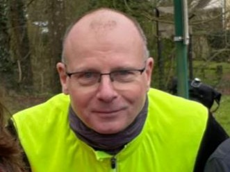
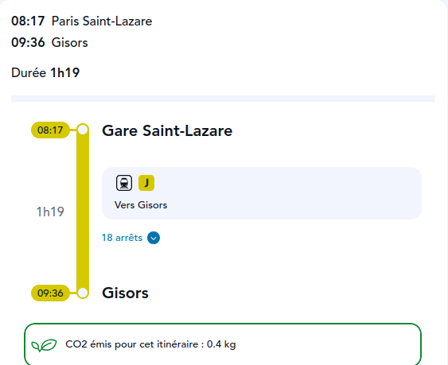
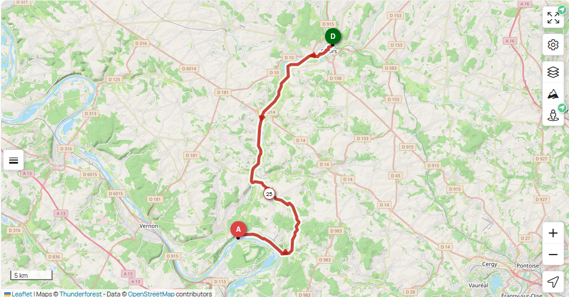
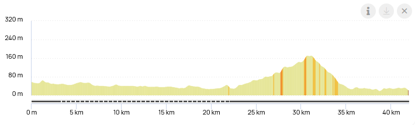
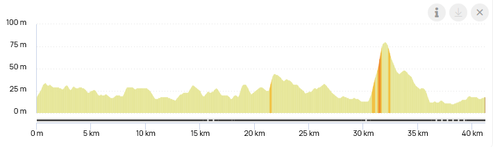
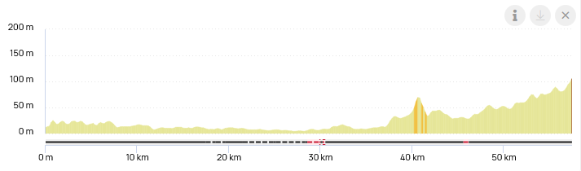
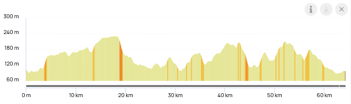
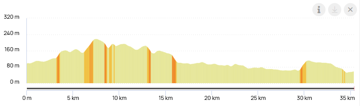
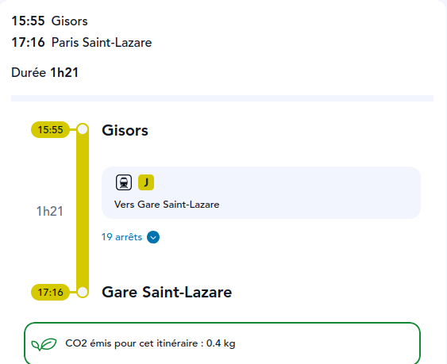

## Eure et Oise à vélo : 239 km +1750 m / -1750 m

<link rel="stylesheet" href="https://unpkg.com/leaflet/dist/leaflet.css"/>

  

    Loading…
    

      <button onclick="rvStop();rvShow(rvPos-1)" style="width:32px;height:32px;border:1px solid #ddd;border-radius:4px;background:#fff;cursor:pointer;font-size:15px;">‹</button>
      <button id="rv-play" onclick="rvPlayStop()" style="width:32px;height:32px;border:1px solid #ddd;border-radius:4px;background:#fff;cursor:pointer;font-size:15px;">▶</button>
      <button onclick="rvStop();rvShow(rvPos+1)" style="width:32px;height:32px;border:1px solid #ddd;border-radius:4px;background:#fff;cursor:pointer;font-size:15px;">›</button>
    

  

  

## 1 - mercredi 17 juin : Paris ⟶ Gisors ⟶ La Roche Guyon

🚆 Paris 08:17 - 09:36 Gisors

<iframe id="widget_autocomplete_preview"  width="150" height="300" frameborder="0" src="https://meteofrance.com/widget/prevision/272840##3D6AA2" title="Gisors"> </iframe>

🚲 <a href="./files/gisors-larocheguyon.gpx">Gisors - La Roche Guyon GPX</a> . 42 km, 265 D+, 300 D-

🏨 <a href="https://maps.app.goo.gl/7trkwBDdTcvqHRBLA">Hotel Les Bords de Seine, 21 rue du Docteur Duval, 95780 La Roche-Guyon</a> · <a href="https://www.booking.com/hotel/fr/les-bords-de-seine.html">Booking</a>

<iframe id="widget_autocomplete_preview"  width="150" height="300" frameborder="0" src="https://meteofrance.com/widget/prevision/955230##3D6AA2" title="La Roche Guyon"> </iframe>

## 2 - jeudi 18 juin, La Roche Guyon ⟶ Les Andelys

🚲 <a href="./files/larocheguyon-lesandelys.gpx">La Roche Guyon - Les Andelys GPX</a> . 42 km, 222 D+, 222 D-

🏨 <a href="https://maps.app.goo.gl/8VnMDgUiGyf8azD79">Hotel Les Iris, 8-10 rue Georges Clémenceau, 27700 Les Andelys</a>· <a href="https://www.booking.com/hotel/fr/les-iris-les-andelys.html">Booking</a>
<ul>
<li>Chambre 1 : 2 lits jumeaux</li>
<li>Chambre 2 : 2 lits jumeaux</li>
</ul>

<iframe id="widget_autocomplete_preview"  width="150" height="300" frameborder="0" src="https://meteofrance.com/widget/prevision/270160##3D6AA2" title="Les Andelys"> </iframe>

## 3 - vendredi 19 juin, Les Andelys ⟶ Lyons La Forêt

🚲 <a href="./files/lesandelys-lyonslaforet.gpx">Les Andelys - Lyons La Foret GPX</a> . 57 km, 290 D+, 195 D-

🏨 <a href="https://maps.app.goo.gl/bkXUkUPyxbVwWpxbA">Camping Saint Paul,
2 Rte Saint-Paul, 27480 Lyons-la-Forêt</a> . <a href="https://campingsaintpaul-27.fr">Site web</a>

<iframe id="widget_autocomplete_preview"  width="150" height="300" frameborder="0" src="https://meteofrance.com/widget/prevision/273770##3D6AA2" title="Lyons la Forêt"> </iframe>

## 4 - samedi 20 juin, Lyons La Forêt ⟶ Gournay en Bray

🚲 <a href="./files/lyonslaforet-gournayenbray.gpx">Lyons La Foret - Gournay en Bray GPX</a> . 64 km, 664 D+, 673 D-

🏨 <a href="https://maps.app.goo.gl/EmV4ZVb5BUa5gztA7">Hotel de Normandie, 21 place nationale, 76220 Gournay-en-Bray</a> . <a href="https://www.booking.com/hotel/fr/de-normandie-gournay-en-bray.html">Booking</a>
<ul>
<li>Chambre 1 : chambre double</li>
<li>Chambre 2 : chambre triple</li>
</ul>

<iframe id="widget_autocomplete_preview"  width="150" height="300" frameborder="0" src="https://meteofrance.com/widget/prevision/763120##3D6AA2" title="Gournay en Bray"> </iframe>

## 5 - dimanche 21 juin, Gournay en Bray ⟶ Gisors ⟶ Paris

🚲 <a href="./files/gournayenbray-gisors.gpx">Gournay en Bray - Gisors GPX</a> . 35 km, 313 D+, 353 D-

🚆 Gisors 15:55 - 17:16 Paris

