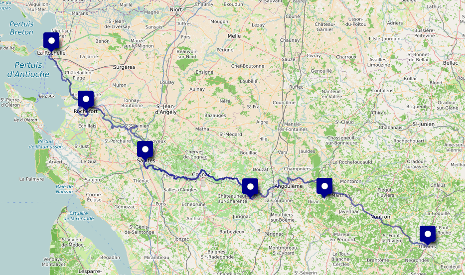
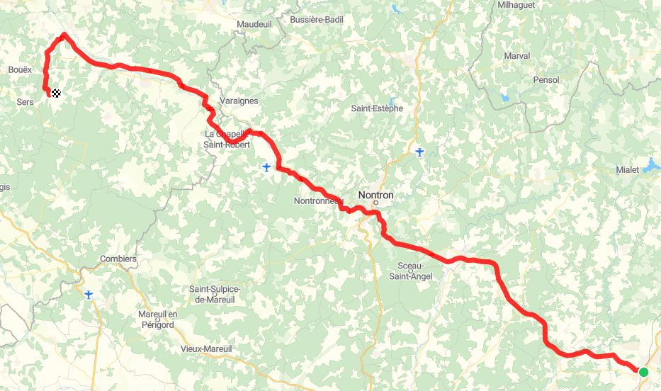
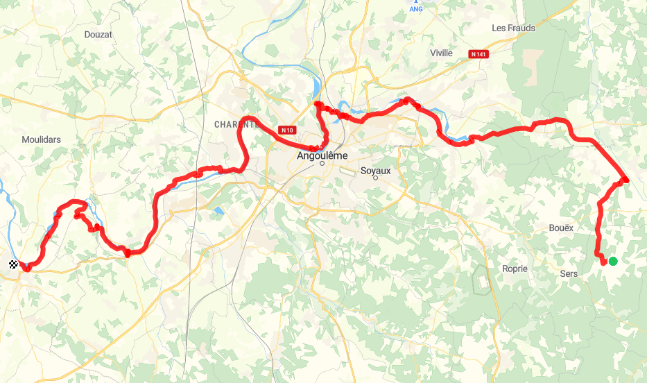
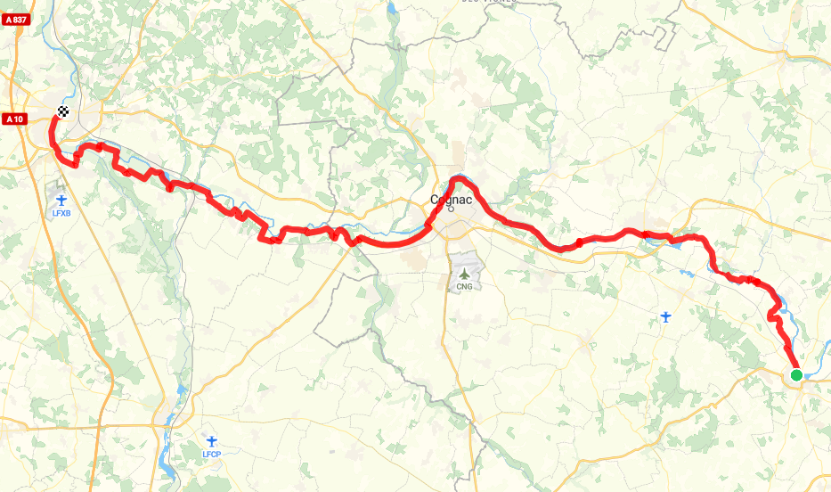
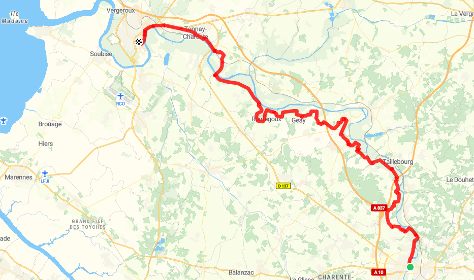
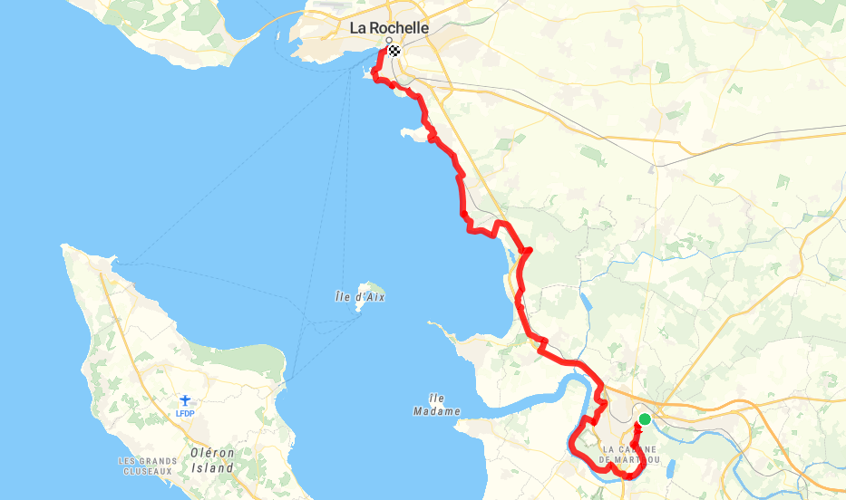

## Flow vélo : 326 km +1730 m / -1975 m

- [Le site officiel](https://www.laflowvelo.com/)

## 1. dimanche 26 avril : Limoges ⟶ Thiviers

🚆 Limoges 16:18 - 17:03 Thiviers

🏨 <a href="https://maps.app.goo.gl/bMN2qgM4Y1PWKgge6">Camping le repaire, 24800 Thiviers, France</a> · <a href="https://www.booking.com/hotel/fr/mobil-home-thiviers.fr.html">Booking</a>

<iframe id="widget_autocomplete_preview"  width="150" height="300" frameborder="0" src="https://meteofrance.com/widget/prevision/245510##3D6AA2" title="Thiviers"> </iframe>

## 2. lundi 27 avril : Thiviers ⟶ Nontron ⟶ Vouzan

🚲 <a href="./files/thiviers-vouzan.gpx">Thiviers - Vouzan GPX</a> . 65 km, 600 D+, 740 D-

🏨 <a href="https://maps.app.goo.gl/t3oU5ogJ51rCcmhP8">L'orée du Bois, 683 Maison Neuve, 16410 Vouzan</a> · <a href="https://www.booking.com/hotel/fr/oree-de-bois.fr.html">Booking</a>

<iframe id="widget_autocomplete_preview"  width="150" height="300" frameborder="0" src="https://meteofrance.com/widget/prevision/164220##3D6AA2" title="Vouzan"> </iframe>

## 3. mardi 28 avril : Vouzan ⟶ Angoulême ⟶ Chateauneuf sur Charente

🚲 <a href="./files/vouzan-chateauneufsurcharente.gpx">Vouzan - Chateauneuf sur Charente GPX</a> . 62 km, 380 D+, 480 D-

🏨 <a href="https://maps.app.goo.gl/Dzib5nZWz7bTQHrq9">Annexe du pont de la Charente Côté jardin, 16 Rue Guy Barat, 16120 Châteauneuf-sur-Charente</a> . <a href="https://www.booking.com/hotel/fr/annexe-du-pont-de-la-charente.html">Booking</a>

<iframe id="widget_autocomplete_preview"  width="150" height="300" frameborder="0" src="https://meteofrance.com/widget/prevision/160900##3D6AA2" title="Chateauneuf sur Charente"> </iframe>

## 4. mercredi 29 avril : Chateauneuf sur Charente ⟶ Cognac ⟶ Saintes

🚲 <a href="./files/chateauneufsurcharente-saintes.gpx">Chateauneuf sur Charente - Saintes GPX</a> . 72 km, 340 D+, 365 D-

🏨 <a href="https://maps.app.goo.gl/EmV4ZVb5BUa5gztA7">La Bastille 1, 1er étage 25 Rue du Lycée Agricole, 17100 Saintes</a> . <a href="https://www.booking.com/hotel/fr/la-bastille-1.html">Booking</a>

<iframe id="widget_autocomplete_preview"  width="150" height="300" frameborder="0" src="https://meteofrance.com/widget/prevision/174150##3D6AA2" title="Saintes"> </iframe>

## 5. jeudi 30 avril : Saintes ⟶ Rochefort

🚲 <a href="./files/saintes-rochefort.gpx">Saintes - Rochefort GPX</a> . 57 km, 260 D+, 250 D-

🏨 <a href="https://maps.app.goo.gl/3Kw1qoVJAZor6n5AA">64 Rue Pierre Loti 17300 Rochefort</a>

<iframe id="widget_autocomplete_preview"  width="150" height="300" frameborder="0" src="https://meteofrance.com/widget/prevision/172990##3D6AA2" title="Rochefort"> </iframe>

## 6. vendredi 1er mai : Rochefort

🚆 Rochefort 09:14 - 10:37 Saujon

🚲 60 km : Saujon - La Tremblade, passeur de la Seudre, Brouage, Rochefort

## 7. samedi 2 mai : Rochefort

🚌 Bus Rochefort - Fouras
<ul>
<li><a href="https://www.rbus-transport.com/fichier_article/images/2025-11%20Plan%20r%C3%A9seau%20RBUS%20.jpg">🚌 plan du réseau Réseau RBUS</a></li>
<li><a href="./files/ligne E.pdf">🚌 ligne E</a></li>
<li><a href="./files/ligne J.pdf">🚌 ligne J</a></li>
</ul>

🥾 Ile d'Aix

## 8. dimanche 3 mai : Rochefort ⟶ La Rochelle

🚲 <a href="./files/rochefort-larochelle.gpx">Rochefort - La Rochelle GPX</a> . 50 km, 150 D+, 140 D-

🏨 <a href="https://maps.app.goo.gl/spA9M14AsB3aDwQR7">Hotel B&B, 140 Bd Joffre, 17000 La Rochelle</a>

<iframe id="widget_autocomplete_preview"  width="150" height="300" frameborder="0" src="https://meteofrance.com/widget/prevision/173000##3D6AA2" title="La Rochelle"> </iframe>

## 9. lundi 4 mai : La Rochelle ⟶ Paris

🚆 La Rochelle 08:48 - 12:33 Paris

<iframe id="widget_autocomplete_preview"  width="150" height="300" frameborder="0" src="https://meteofrance.com/widget/prevision/751010##3D6AA2" title="La Rochelle"> </iframe>

