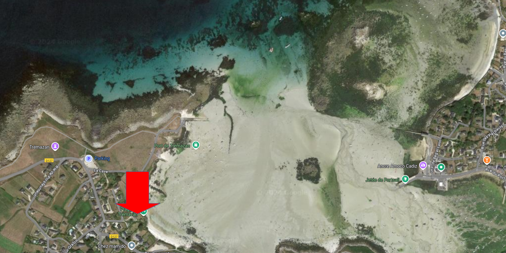

# La maison

<https://www.airbnb.fr/rooms/5009565>

 

Adresse : [2 Impasse de la Cave, 29840 Landunvez](https://maps.app.goo.gl/2ZrQymahHMxkQm5CA)

Coût :

- maison : 2711€59
- draps + linge de toilette : ???
- ménage : ???

<!---
Chambres :

- 1 chambre double (10, 20, 21)
- 1 chambre double (11)
- 1 chambre double (12, )
- 1 chambre double (14, )
- 1 chambre double (15, )
- 2 lits superposés (13, )
- 1 lit bateau (23)
- 1 lit simple (24)
- 1 chambre double avec douche (26)

- Rdc : 1 chambre double vue mer
- 1er étage :
    - 4 chambres double vue mer
    - 1 chambres deux lits simples superposés vue jardin
    - 1 dortoir 2 lits simples 1 lit.
-->

# Liaison avec Brest TGV 🚆

- 🚌 ligne 914 : Brest (gare routière SNCF) - Portsall Eglise

