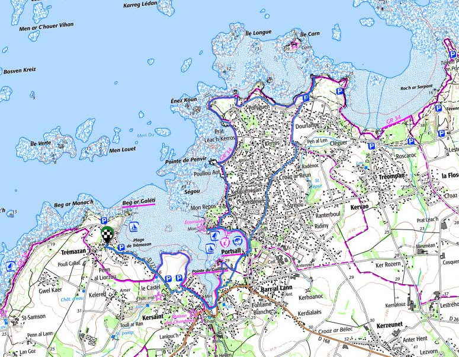
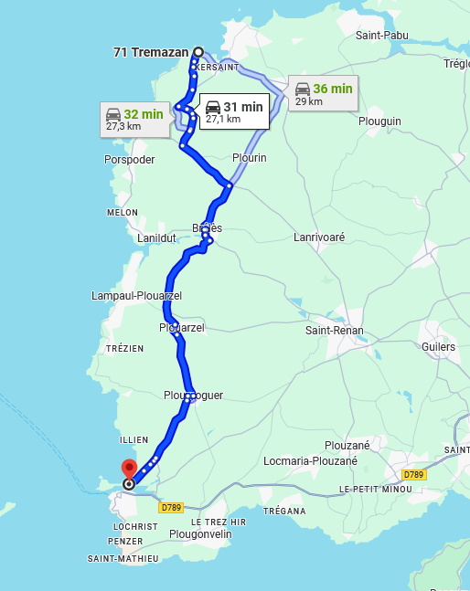
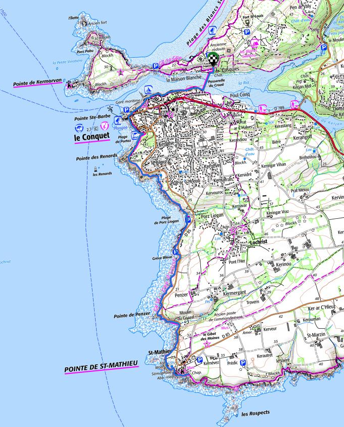
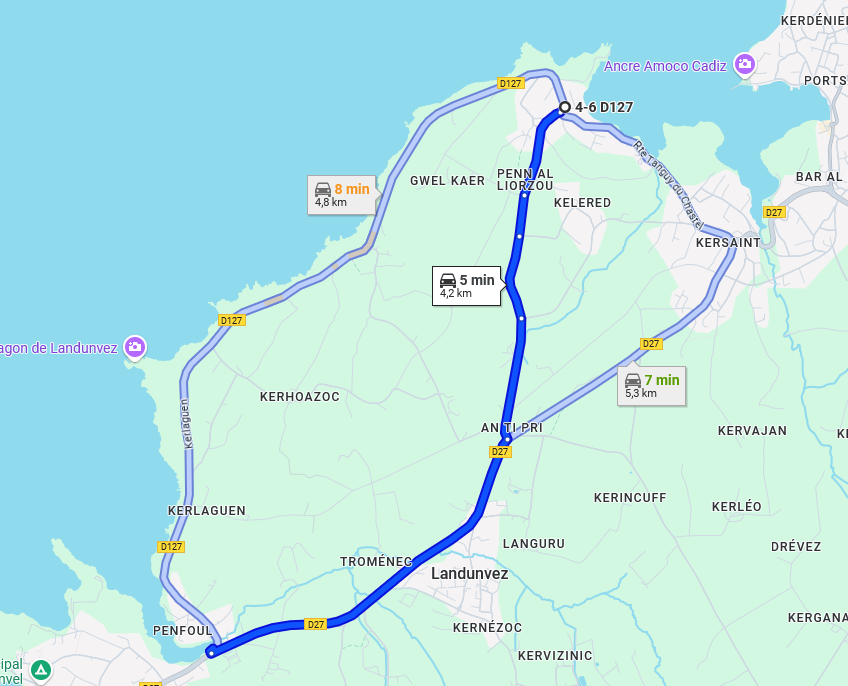
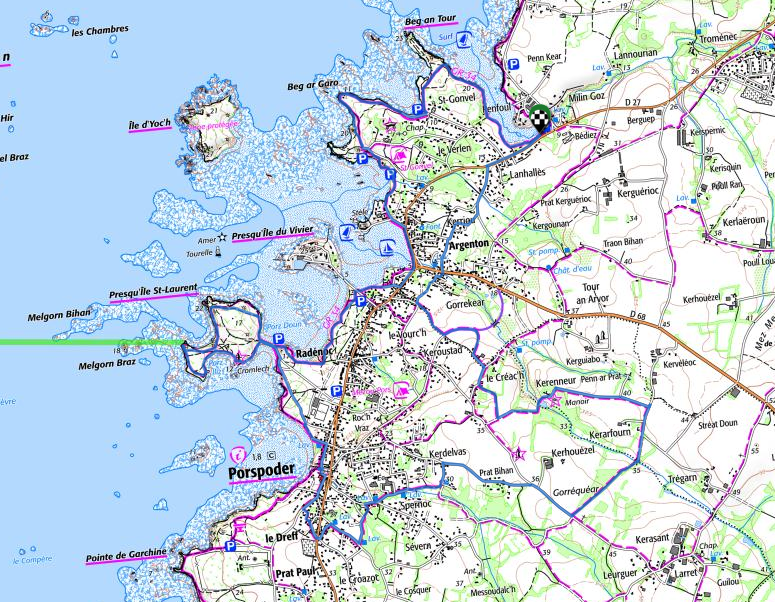
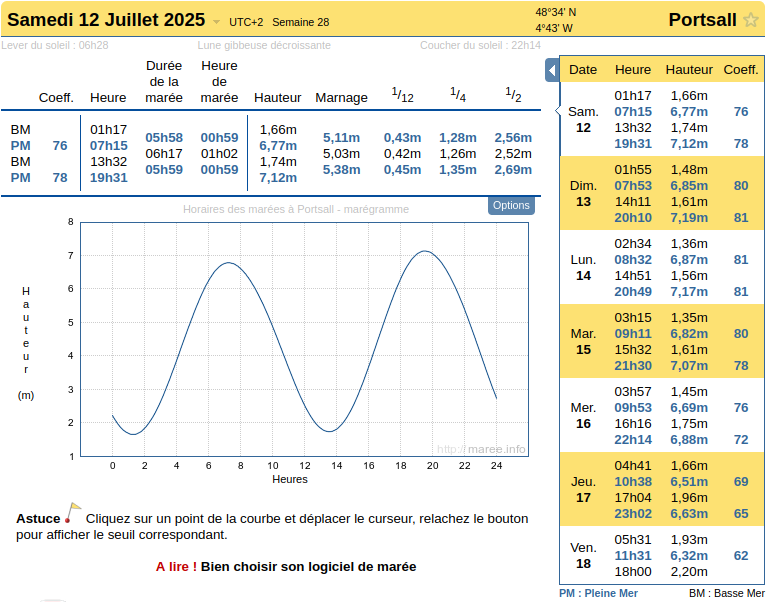

# La maison

<https://www.airbnb.fr/rooms/5009565>

 

Adresse : [2 Impasse de la Cave, 29840 Landunvez](https://maps.app.goo.gl/2ZrQymahHMxkQm5CA)

Coût :

- maison : 2711€59
- draps + linge de toilette : ???
- ménage : ???

<!---
Chambres :

- 1 chambre double (10, 20, 21)
- 1 chambre double (11)
- 1 chambre double (12, )
- 1 chambre double (14, )
- 1 chambre double (15, )
- 2 lits superposés (13, )
- 1 lit bateau (23)
- 1 lit simple (24)
- 1 chambre double avec douche (26)

- Rdc : 1 chambre double vue mer
- 1er étage :
    - 4 chambres double vue mer
    - 1 chambres deux lits simples superposés vue jardin
    - 1 dortoir 2 lits simples 1 lit.
-->

# Liaison avec Brest TGV 🚆

- 🚌 ligne 914 : Brest (gare routière SNCF) - Portsall Eglise

# L'ile Carn : dimanche 13 juillet [🥾](https://ignrando.fr/fr/parcours/fiche/details/id/2908255)

📍 la maison, 09:30. L’île est accessible uniquement à marée basse par coefficient d'au moins 80. Marée basse à 14:11. Voir [les horaires de marée](#les-marées).

🥾 12 km, D+160

# L'aber Ildut [🥾](https://ignrando.fr/fr/parcours/fiche/details/id/2908227)

📍 [parking route du Crapaud](https://maps.app.goo.gl/Y7PutgJezKyGak497) : 🚗 00:20, 15 km

Horaires du [passeur](https://www.iroise-bretagne.bzh/commerce/passage-de-laber-phine-la-passeuse/) : 09:30 - 11:30	et 14:30 - 17:00, tous les jours. Appeler la Capitainerie la veille (tel:06.31.93.58.71)

🥾 14 km, D+100

# Cap sur Ouessant 🚲 31 km

📍 [parking route du Crapaud](https://maps.app.goo.gl/Y7PutgJezKyGak497) : 🚗 00:20, 15 km

⛵ 00:30

Location vélo à la journée :

- 14€00, VTT/VTC
- 30€00, vélo électrique

Loueurs :

- Cycle Évasion : 02.98.48.85.15 
- La Bicyclette : 06.80.70.94.95
- Ouessancycles : 02.98.48.83.44 ou 06.81.89.11.41

A voir :

- ⛪ L’église Saint Pol-Aurélien
- ⛪ Le musée des phares et balises
- ⛪ Le phare du Creac’h
- 🌊 La pointe de Kadoran
- 🌊 La pointe de Porz Doun
- 🌊 Le port d’Arlan
- 🌊 La pointe de Pern

# Du Conquet à la Pointe Saint Mathieu

📍[Passerelle du Croaë](https://maps.app.goo.gl/zi5PGoiC8bkv734y8) : 🚗 00:31, 27 km

🥾 12 km, D+50

# Porspoder et les lavoirs [🥾](https://ignrando.fr/fr/parcours/fiche/details/id/2908755)

📍[parking plage du Penfoul](https://maps.app.goo.gl/NPAxfjhKVGw5DN3U6) : 🚗 00:05, 4 km

🥾 15 km, D+100

# Journées off

- La pointe de Landunvez et [la chapelle Saint Samson](https://www.iroise-bretagne.bzh/activite/chapelle-saint-samson/) 🥾 5 km A/R
- [L'espace muséographique L'Ancre An Eor](https://www.iroise-bretagne.bzh/activite/lancre-an-eor-espace-museographique-dans-le-sillage-de-lamoco-cadiz/) 🥾 5 km A/R

# Les marées

