

# [La maison](https://www.abritel.fr/trips/9208507122516/)

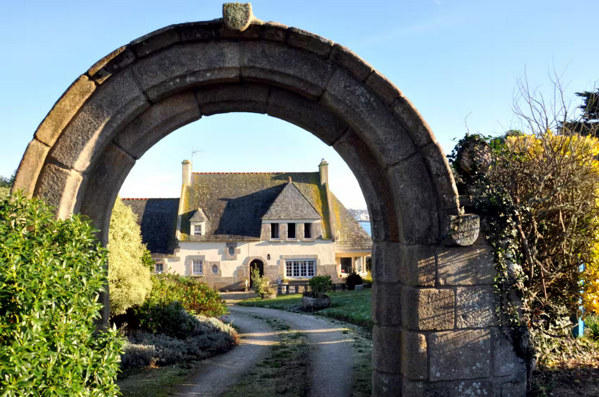 

Coût :

- maison : 2323€20
- draps + linge de toilette : 130€00
- ménage : 170€00

# Liaison avec Quimper TGV 🚆

- 🚌 ligne 56C : Quimper (SNCF) - Plobannalec Lesconil, (arrêt Loctudy Kerizur), 13:15 → 14:15, 17:15 → 18:15 (samedi)
- 🚌 ligne 56C : Plobannalec Lesconil, (arrêt Loctudy Kerizur) - Quimper (SNCF) - , 09:49 → 10:50, 11:39 → 12:40 (samedi)

# Carte du séjour

<iframe width="100%" height="400px" frameborder="0" allowfullscreen src="https://umap.openstreetmap.fr/fr/map/2024-pays-bigouden_1071168#12/47.8348/-4.2054"></iframe>
<a href="https://umap.openstreetmap.fr/fr/map/2024-pays-bigouden_1071168#12/47.8348/-4.2054">Voir en plein écran</a>

- **Rouge** : 🥾
- **Noir** : 🚌
- **Bleu** : ⛵

# Autour de Loctudy 🥾

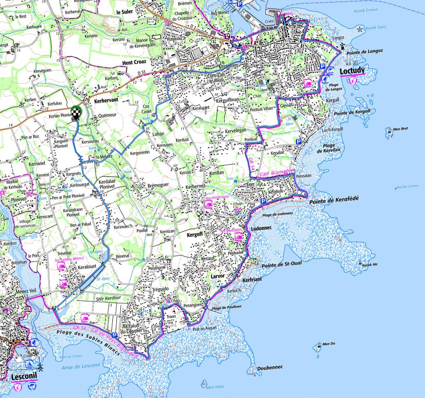

# Entre Eckmül et La Torche 🥾

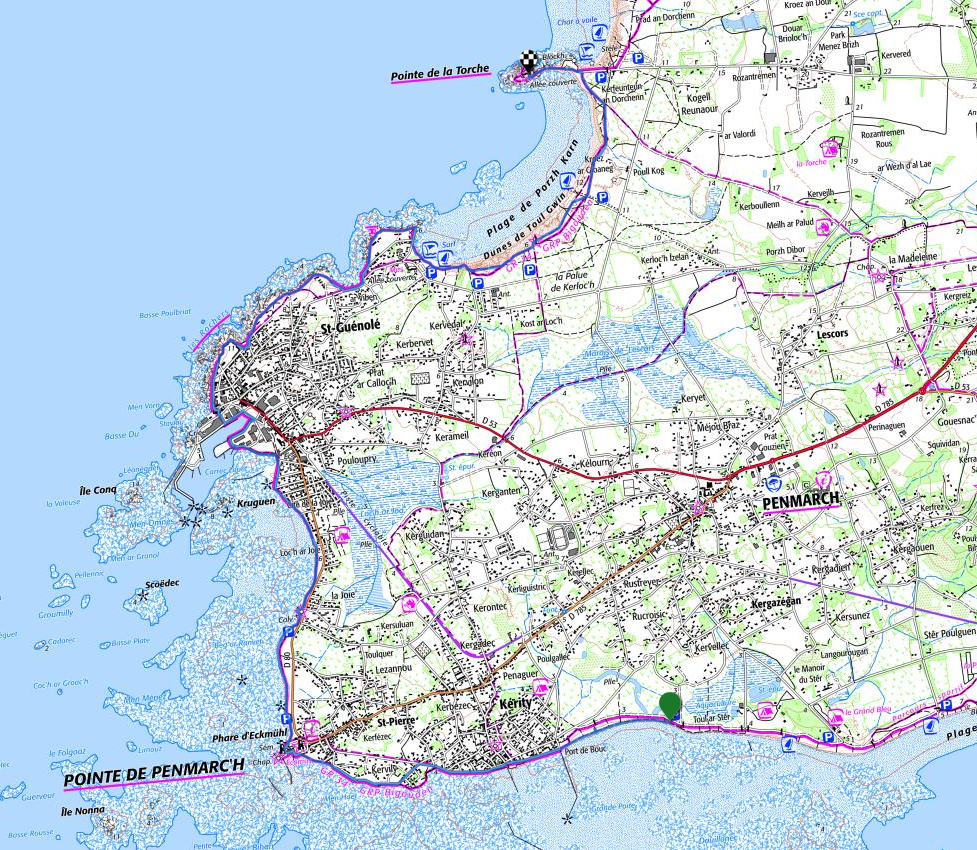

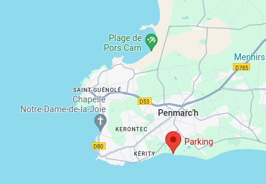

Retour

  - 🚌 ligne 56A, La Torche 17:00 - 17:15 Kerity
  - 🥾 10 mn jusqu'à la voiture
  - 🚗 18 mn

# Depuis Le Guilvinec 🥾

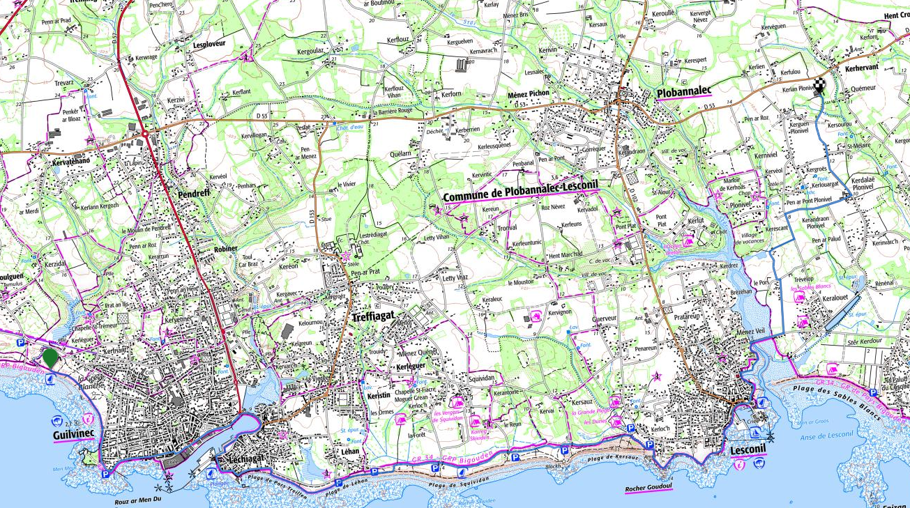

Aller

  - 09:45, 🥾 45 mn
  - 🚌 ligne 56A, Plobannalec Lesconil Mairie 10:51 - 11:09 Le Guilvinec Kerleguer

# L’Ile-Tudy 🥾

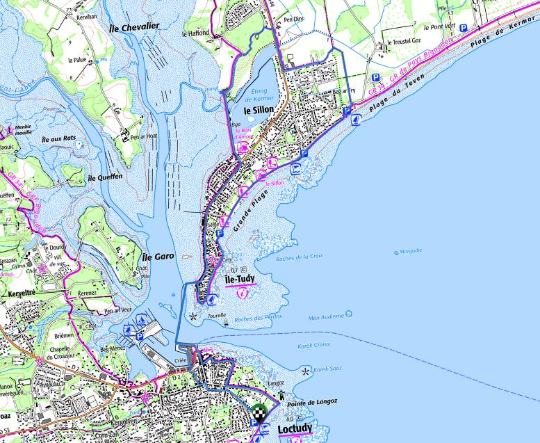

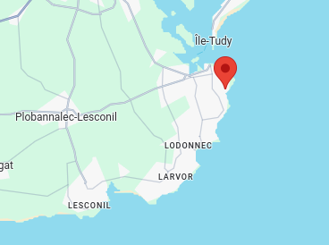

- Parcours patrimonial
- Passeur Loctudy - L’Ile Tudy : 02€00

# Sainte Marine - Bénodet 🥾

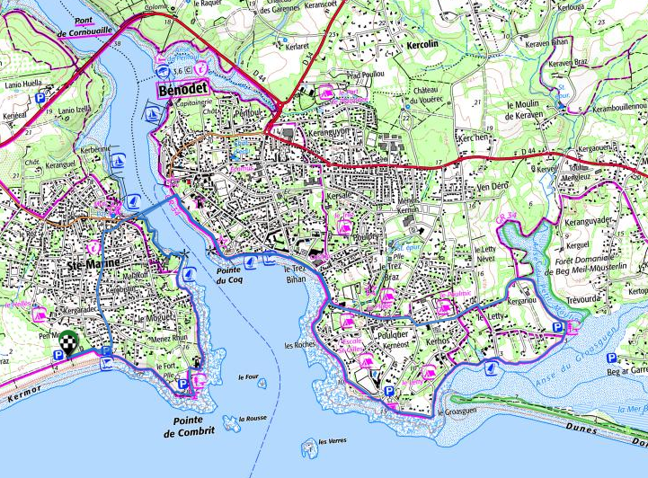

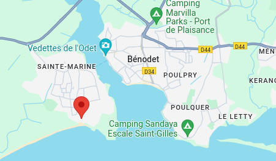

# [Croisière sur l’Odet](https://www.vedettes-odet.com/produit/riviere-odet/grande-croisiere-promenade-odet/) ⛵

Aller

- 09:30 (Bénodet) - 10:30 (Quimper). 09:00 sur place
- Débarquement à Corniguel + 15 mn bus jusqu’au centre ville

Retour

- 16 juillet retour à 15:45 (Quimper) -16:45 (Bénodet)
- 17 juillet retour à 18:15 (Quimper) - 19:15 (Bénodet)

29€00/personne + 3€00 bus

# [Archipel des Glénan](https://www.vedettes-odet.com/categorie-produit/iles-glenan/) ⛵

- Départ de Loctudy, 39€00 / personne
- Options
  - [découverte archipel](https://www.vedettes-odet.com/produit/iles-glenan/iles-glenan-decouverte-de-larchipel/) + 10€00
  - [vision sous marine](https://www.vedettes-odet.com/produit/iles-glenan/exploration/) + 15€00
  - [kayak biplace](https://www.vedettes-odet.com/produit/iles-glenan/escapade-kayak-mer/) + 55€00

Horaires :

- 10:15 - 17:30 (journée)
- 13:15 - 17:30 (½ journée)

# Les marées

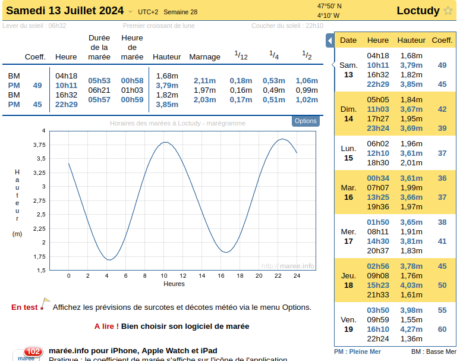

# Finances

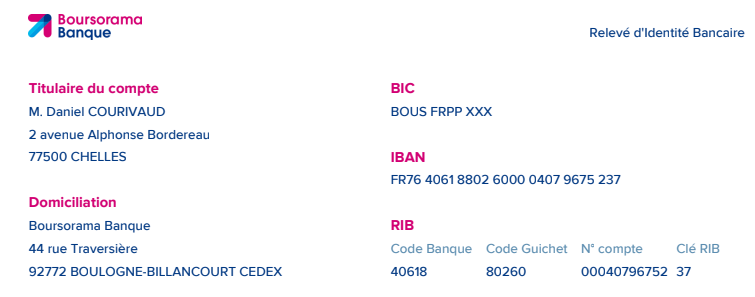

280€00 / personne.

[Le lien Tricount](https://tricount.com/tLcpsLLNlVYdrkaASe) à coller dans l'appli Android ou iOS.

