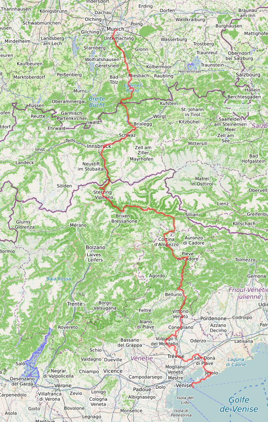
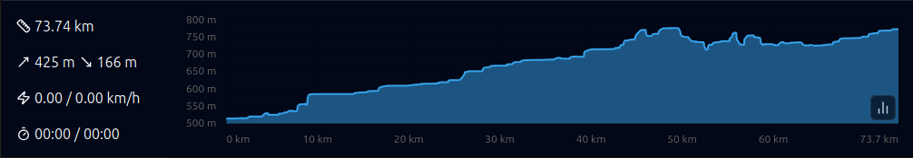
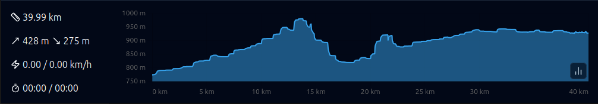
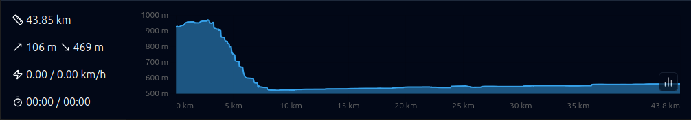
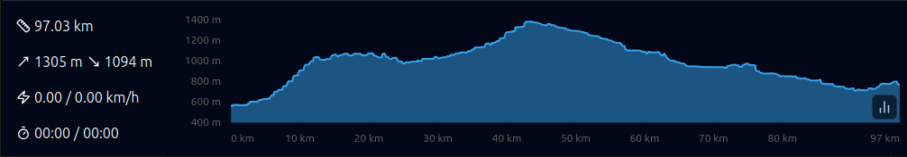
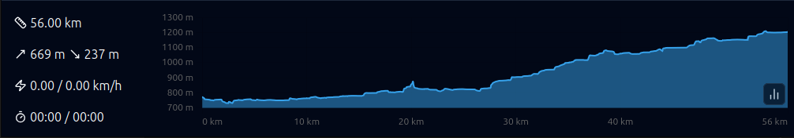
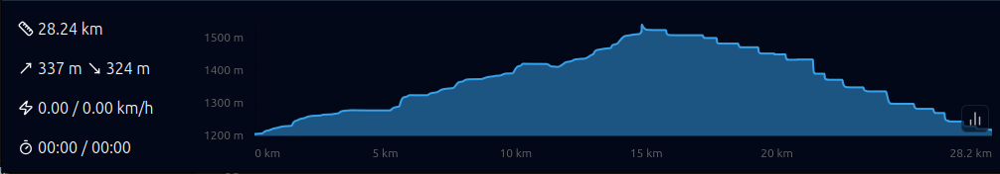
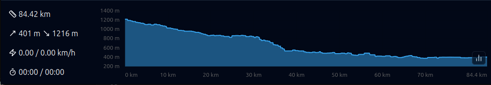
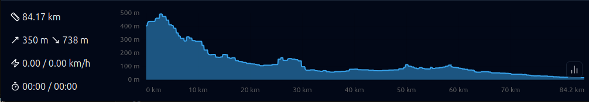

# Munich - Venise : 597 km +3611 m / -4128 m

- [Le site officiel](https://muenchen-venezia.info/en/)
- [GPX](files/munich-venise-est.gpx)

# 1. mercredi 23 juillet : Paris - Munich

- 🚆 Paris Est 15:55 - 21:36 Munich (134€00)
    - [Billet Raphaël](./files/PARIS_MUNICH_RAPHAEL.pdf)
    - [Billet Daniel](./files/PARIS_MUNICH_DANIEL.pdf)
- 🏨 [Euro Youth Hotel Senefelderstraße 3, 80336 München](https://maps.app.goo.gl/ACrAehBzqFMG1pLy6)
    - confirmé : 94€41
    - [Booking : 4651912927 / 4337](https://secure.booking.com/confirmation.en-us.html?aid=304142&label=gen173nr-1FCAEoggI46AdIM1gEaE2IAQGYATG4ARnIAQ_YAQHoAQH4AQKIAgGoAgO4As7P88MGwAIB0gIkZjRmODVhZTUtOTJiYi00ODczLTkwZjEtOGZkNTIzNjBjNjEx2AIF4AIB&auth_key=th8BPizc6aJUrHU6&source=mytrips)

# 2. jeudi 24 juillet : ⟶ Kreuth

- [GPX](./files/1-munich-kreuth.gpx)

- 🏨 [Gasthof zur Post Nördliche Haupstrasse 5-7, 83708 Kreuth](https://maps.app.goo.gl/vCxHx2kg13YzsFmo7)
    - confirmé : 134€00
    - [Booking : 4577271011 / 8439](https://secure.booking.com/confirmation.en-us.html?aid=304142&label=gen173nr-1FCAEoggI46AdIM1gEaE2IAQGYATG4ARnIAQ_YAQHoAQH4AQKIAgGoAgO4As7P88MGwAIB0gIkZjRmODVhZTUtOTJiYi00ODczLTkwZjEtOGZkNTIzNjBjNjEx2AIF4AIB&auth_key=F5GsPCd7zIKVT1mL&source=mytrips)

# 3. vendredi 25 juillet : ⟶ Pertisau

- [GPX](./files/2-kreuth-pertisau.gpx)

- 🏨 [Two Brothers Inn 5 Oberdorfweg, 6213 Pertisau](https://maps.app.goo.gl/HeYtd4EPgmvUMYbs6)
    - 168€80, annulé par Booking mais réservé par l'hotel. Cf messages ci dessous
    - [Booking : 4392080740 / 6956](https://secure.booking.com/confirmation.en-us.html?label=gen173nr-1FCAEoggI46AdIM1gEaE2IAQGYATG4ARnIAQ_YAQHoAQH4AQKIAgGoAgO4As7P88MGwAIB0gIkZjRmODVhZTUtOTJiYi00ODczLTkwZjEtOGZkNTIzNjBjNjEx2AIF4AIB&sid=17b89a66dabce369e1957d1731386ea2&aid=304142&auth_key=5ghbBmyX98h0nZ5n&source=mytrips)

# 4. samedi 26 juillet : ⟶ Innsbruck

- [GPX](./files/3-pertisau-innsbruck.gpx)

- 🏨 [Pension Stoi budget guesthouse, Salurner Straße 7, Wilten, 6020 Innsbruck](https://maps.app.goo.gl/GYLpu7pk3mYJaL898)
    - confirmé : 145€00
    - [Booking : 4404643659 / 2816](https://secure.booking.com/confirmation.en-us.html?aid=304142&label=gen173nr-1FCAEoggI46AdIM1gEaE2IAQGYATG4ARnIAQ_YAQHoAQH4AQKIAgGoAgO4As7P88MGwAIB0gIkZjRmODVhZTUtOTJiYi00ODczLTkwZjEtOGZkNTIzNjBjNjEx2AIF4AIB&auth_key=HAYIK4SlqrnVvpkg&source=mytrips)

# 5. dimanche 27 juillet : ⟶ Brenner ⟶ Rio di Pusteria

- 🚆  Innsbruck 09:24 - 10:00 Brenner
    - billets à acheter

- [GPX](./files/4-brenner-rio-di-pusteria.gpx)

- 🏨 [Hotel B&B Gasthof Zur Linde Via Katharina Lanz 80, 39037 Rio di Pusteria](https://maps.app.goo.gl/BCsm7PsK6GBRgBVi8)
    - confirmé : 144€32
    - [Booking : 4975049748 / 0564](https://secure.booking.com/confirmation.en-us.html?aid=304142&label=gen173nr-1FCAEoggI46AdIM1gEaE2IAQGYATG4ARnIAQ_YAQHoAQH4AQKIAgGoAgO4As7P88MGwAIB0gIkZjRmODVhZTUtOTJiYi00ODczLTkwZjEtOGZkNTIzNjBjNjEx2AIF4AIB&auth_key=TtWsfkuSk35pedc1&source=mytrips)

# 6. lundi 28 juillet : ⟶ Brunico ⟶ Dobbiaco

- [GPX](./files/5-rio-di-pusteria-dobbiaco.gpx)

- 🏨 [Guesthouse - Cultural Center Gustav Mahler 43 Via Dolomiti, 39034 Dobbiaco](https://maps.app.goo.gl/tKCRPRN2SRTiu5AJA)
    - confirmé : 217€69 (payé 212€29)
    - [Booking : 4410025751 / 6532](https://secure.booking.com/confirmation.en-us.html?aid=304142&label=gen173nr-1FCAEoggI46AdIM1gEaE2IAQGYATG4ARnIAQ_YAQHoAQH4AQKIAgGoAgO4As7P88MGwAIB0gIkZjRmODVhZTUtOTJiYi00ODczLTkwZjEtOGZkNTIzNjBjNjEx2AIF4AIB&auth_key=SOEtzV5A6yRMTMgE&source=mytrips)

# 7. mardi 29 juillet : ⟶ Cortina

- [GPX](./files/6-dobbiaco-cortina.gpx)

- 🏨 [Hotel Olimpia, Largo Poste 37, 32043 Cortina dʼAmpezzo](https://maps.app.goo.gl/3qhzkdxEk6cfBMzr5)
    - confirmé : 241€86
    - [Booking : 4921905287 / 5780](https://secure.booking.com/confirmation.en-us.html?aid=304142&label=gen173nr-1FCAEoggI46AdIM1gEaE2IAQGYATG4ARnIAQ_YAQHoAQH4AQKIAgGoAgO4As7P88MGwAIB0gIkZjRmODVhZTUtOTJiYi00ODczLTkwZjEtOGZkNTIzNjBjNjEx2AIF4AIB&auth_key=pKi5gu5KGDNgzusg&source=mytrips)

# 8. mercredi 30 juillet : ⟶ Farra d’Alpago

- [GPX](./files/7-cortina-farra-d-alpago.gpx)

- 🏨 [Emozioni al Lago, Via Poiatte, 39/a, 32016 Farra dʼAlpago](https://maps.app.goo.gl/SzknLLyUTCFQen6A9)
    - confirmé : 137€00
    - [Booking : 4783472394 / 1987](https://secure.booking.com/confirmation.en-us.html?aid=304142&label=gen173nr-1FCAEoggI46AdIM1gEaE2IAQGYATG4ARnIAQ_YAQHoAQH4AQKIAgGoAgO4As7P88MGwAIB0gIkZjRmODVhZTUtOTJiYi00ODczLTkwZjEtOGZkNTIzNjBjNjEx2AIF4AIB&auth_key=KDWWyIiWUlBLMrr6&source=mytrips)

# 9. jeudi 31 juillet : ⟶ Trevise

- [GPX](./files/8-farra-d-alpago-trevise.gpx)

- 🏨 [B&B Madam Treviso, Via Risorgimento 12 1° Piano, 31100 Trévise](https://maps.app.goo.gl/DFGBxBmGzHg7ksEa7)
    - confirmé : 70€00
    - [Booking : 4765606690 /  4519](https://secure.booking.com/confirmation.en-us.html?aid=304142&label=gen173nr-1FCAEoggI46AdIM1gEaE2IAQGYATG4ARnIAQ_YAQHoAQH4AQKIAgGoAgO4As7P88MGwAIB0gIkZjRmODVhZTUtOTJiYi00ODczLTkwZjEtOGZkNTIzNjBjNjEx2AIF4AIB&auth_key=PxlkpOkOM2nW8Fvq&source=mytrips)
    - Formalité : envoyer la copie des pièces d’identité la veille à  info@babtreviso.com

# 10. vendredi 1 août, samedi 2 août : ⟶ Venise

- 🏨 [Hotel Delle Rose, Via Elia Millosevich 46, 30173 Mestre](https://maps.app.goo.gl/A4hTRnriH4Uus7KC7)
    - confirmé : 167€60
    - [Booking : 4313014766 / 9073](https://secure.booking.com/confirmation.en-us.html?aid=304142&label=gen173nr-1FCAEoggI46AdIM1gEaE2IAQGYATG4ARnIAQ_YAQHoAQH4AQKIAgGoAgO4As7P88MGwAIB0gIkZjRmODVhZTUtOTJiYi00ODczLTkwZjEtOGZkNTIzNjBjNjEx2AIF4AIB&auth_key=HkaEgfzdAZKJ2pHV&source=mytrips)

# 11. dimanche 3 août : ⟶ Paris

- 🚆  Venezia Mestre 13:00 - 15:15 Milano Centrale (58€80)
    - [Billet Raphaël](./files/VENISE_MILAN_RAPHAEL.pdf)
    - [Billet Daniel](./files/VENISE_MILAN_DANIEL.pdf)

Visite de Milan à vélo : https://umap.openstreetmap.fr/fr/map/milan_1219064

- 🚆 Milano Centrale 15:53 - 22:34 Paris (178€00)
    - [Billet Raphaël](./files/MILAN_PARIS_RAPHAEL.pdf)
    - [Billet Daniel](./files/MILAN_PARIS_DANIEL.pdf)